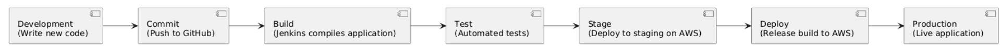
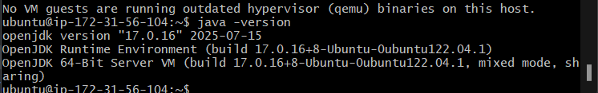
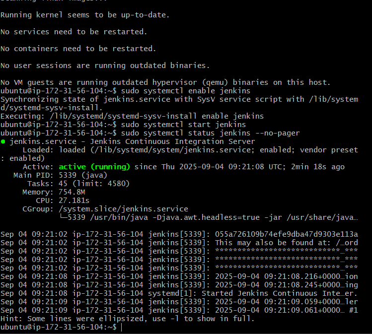
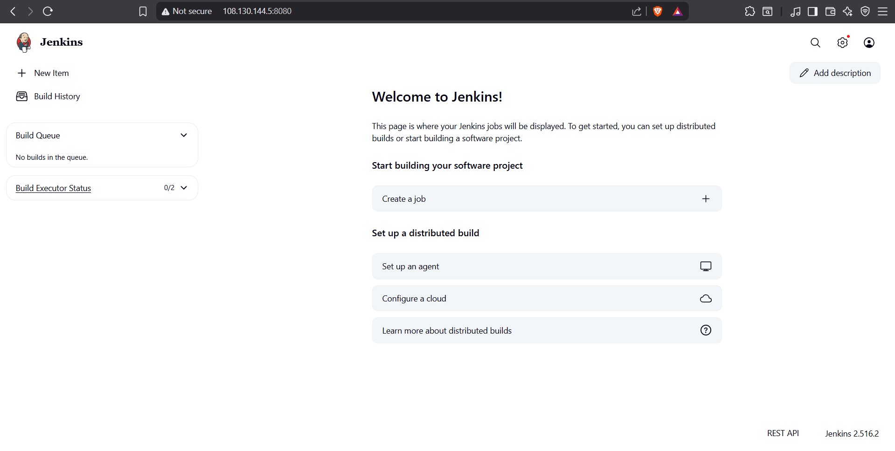

# Jenkins and CI/CD Overview

## What is Jenkins?
Jenkins is an open-source automation tool that helps teams **build, test, and deploy** software automatically.  
Instead of doing everything manually, Jenkins can:  
- Pull code from a repository (e.g., GitHub)  
- Build the application  
- Run automated tests  
- Deploy the application to servers  

This makes software delivery **faster, more reliable, and less error-prone**.  

---

## What is CI/CD?
**CI/CD** stands for **Continuous Integration** and **Continuous Delivery/Deployment**. It is a modern way of delivering software efficiently.  

- **Continuous Integration (CI):**  
  Every time developers push new code, it is automatically built and tested.  
  *Goal: Catch errors early and ensure new code works with the project.*  

- **Continuous Delivery (CD):**  
  After passing tests, the code is packaged and prepared for release.  
  *Goal: Code is always ready to be deployed with one click.*  

- **Continuous Deployment (CD):**  
  The process goes one step further — the code is automatically deployed to production.  
  *Goal: Fully automated release pipeline.*  

Together, CI/CD ensures that updates are delivered **quickly, consistently, and safely**.  

---

## Why Use Jenkins with AWS?
When Jenkins is combined with **Amazon Web Services (AWS)**, it becomes even more powerful.  
AWS provides the cloud infrastructure, while Jenkins handles the automation.  

Typical integrations include:  
- Deploying applications to **AWS EC2 servers**  
- Storing build files in **S3 buckets**  
- Running scalable apps with **ECS or EKS**  
- Automating infrastructure with **Terraform or CloudFormation**  

This creates a smooth pipeline where code moves from development → testing → deployment in the cloud.  

---

## CI/CD Pipeline with Jenkins and AWS
Below is a simple diagram of how Jenkins integrates with AWS services in a CI/CD pipeline:  



---

## Summary
- **Jenkins** provides the automation.  
- **CI/CD** defines the process.  
- **AWS** delivers the cloud infrastructure.  

Together, they enable **fast, reliable, and scalable software delivery**.  

## Creation of Jenkins Server on AWS step by step:
1) Login to your aws and click launch instance 
2) Give a name tag "rubaet-jenkins-server"
3) Select UBUNTU as your AMI
4) Select Ubuntu server 22.04 LTS
5) For the instance type select t3.small well depends on how big is your project 
6) Select your key pair login 
7) Click on allow HTTP and create your security group if you haven't "rubaet-jenkins-allow-http" and description "rubaet-jenkins-allow-http-this-is-jenkins"
8) Select the inbound security group rule to :
````
SSH
Type: SSH
Port: 22
Source: your IP only

Jenkins Web UI
Type: Custom TCP
Port: 8080
Source: your IP only
````
9) Storage: 30–40 GB gp3 is comfortable.
10) Click Launch instance → wait until Instance state = Running.
11) Open gitbash cd to your ssh and connect to your jenkins ec2 you have created 
12) Click you jenkins ec2 and click connect and copypaste into your gitbash command follows :
- chmod 400 "tech508-rubaet-aws.pem"
- ssh -i "tech508-rubaet-aws.pem" ubuntu@ec2-108-130-144-5.eu-west-1.compute.amazonaws.com
13) You must do the Update system  `apt-get update && sudo apt-get -y upgrade` adn after `sudo timedatectl set-timezone Europe/London   # optional, set correct timezone`
14) Install Java (required by Jenkins) `sudo apt-get install -y openjdk-17-jre`
15) Check Java version `java -version` and should give you version 17 this is the output you should get:
- 
16) Install Jenkins # Add Jenkins repo key`curl -fsSL https://pkg.jenkins.io/debian-stable/jenkins.io-2023.key | \
  sudo tee /usr/share/keyrings/jenkins-keyring.asc >/dev/null`
17) Add Jenkins repo `echo "deb [signed-by=/usr/share/keyrings/jenkins-keyring.asc] \
https://pkg.jenkins.io/debian-stable binary/" | \
  sudo tee /etc/apt/sources.list.d/jenkins.list >/dev/null`
18) Install Jenkins `sudo apt-get update` and after `sudo apt-get install -y jenkins`
19) Start Jenkin serive `sudo systemctl enable jenkins` and after `sudo systemctl start jenkins` and finally `sudo systemctl status jenkins --no-pager` If it says “active (running)”, Jenkins is up.

20) Get admin password `sudo cat /var/lib/jenkins/secrets/initialAdminPassword`
21) Should give you a long digit password save it and then use it to login to jenkins 
22) Open Jenkins in browser
23) Visit: http://<EC2_PUBLIC_IP>:8080
24) Paste the admin password
25) Click Install Suggested Plugins
26) Create your admin user 
27) Set Jenkins URL → keep as http://108.130.144.5:8080/
28) Jenkins server has successfully been created!

