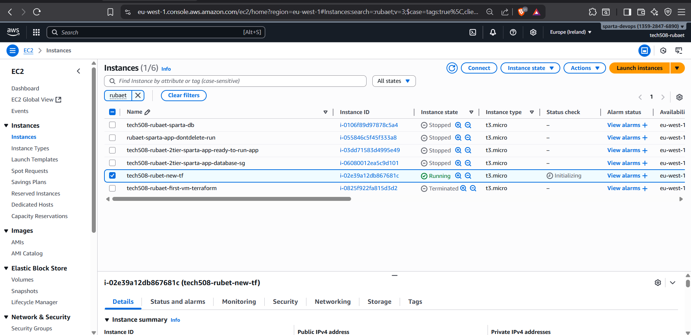

<!-- TOC -->
* [Intro to IaC (Infrastructure as Code)](#intro-to-iac-infrastructure-as-code)
  * [Why Do We Need IaC?](#why-do-we-need-iac)
    * [Old Way (Manual Setup)](#old-way-manual-setup)
    * [IaC Way](#iac-way)
  * [Orchestration vs. Configuration Management](#orchestration-vs-configuration-management)
    * [1. Configuration Management Tools](#1-configuration-management-tools)
    * [2. Orchestration Tools](#2-orchestration-tools)
  * [Benefits of IaC](#benefits-of-iac)
  * [Terraform: The Most Popular IaC Tool](#terraform-the-most-popular-iac-tool)
    * [What is Terraform?](#what-is-terraform)
    * [Terraform Language](#terraform-language)
    * [How Terraform Works (Workflow)](#how-terraform-works-workflow)
    * [Example: Creating an AWS EC2 Instance with Terraform](#example-creating-an-aws-ec2-instance-with-terraform)
  * [Quick Recap](#quick-recap)
  * [How to Create_ec2 script use only variables](#how-to-create_ec2-script-use-only-variables)
  * [To create and run the app database:](#to-create-and-run-the-app-database)
  * [Creation of TF script to create a VPC](#creation-of-tf-script-to-create-a-vpc)
<!-- TOC -->

# Intro to IaC (Infrastructure as Code)

What is Infrastructure as Code (IaC)?
Imagine setting up a new computer or server. Normally, you'd log in, install software, configure settings, and connect it to a network. Doing this manually works fine for one or two machines, but what if you need 100 servers? Or if you want to recreate the same setup tomorrow? Manual work quickly becomes slow, error-prone, and inconsistent.

That's where **Infrastructure as Code (IaC)** comes in.

IaC is the practice of writing code to define and manage infrastructure such as servers, networks, databases, and storage. Instead of clicking through dashboards or typing commands one by one, you describe what your system should look like in a code file. A tool (like Terraform) then reads your code and automatically builds the infrastructure.

In short, if your infrastructure is defined as code, you can automate it, reuse it, share it, and track it just like normal software.

---

## Why Do We Need IaC?
Let's compare the old way versus the IaC way.

### Old Way (Manual Setup)
* Log into the AWS console, and then click "Create Instance."
* Choose an AMI, instance type, and networking.
* Install Nginx manually with SSH.
* Set up a firewall and security groups.
* Hope you remember the same steps next time.

Problems: This method is slow, inconsistent, prone to mistakes, and difficult to reproduce.

### IaC Way
* Write a small script in a language like Terraform or Ansible that says: "I want one EC2 instance in eu-west-1 with Nginx installed."
* Run one command, and the IaC tool provisions everything for you.
* Next time, just run the same script to get an identical setup every time.

Benefits: This method is fast, repeatable, version-controlled, and reliable.

---

## Orchestration vs. Configuration Management
IaC tools generally fall into two categories. It's important to understand the difference.

### 1. Configuration Management Tools
* **Focus:** Manage software and settings inside existing servers.
* **Tasks:** Install packages, configure apps, update files, deploy code.
* **Good when:** You already have servers and just need to configure them consistently.
* **Examples:** Chef, Puppet, and Ansible.
* **Example:** You have 10 servers. Use Ansible to install Nginx and configure the firewall on all of them.

### 2. Orchestration Tools
* **Focus:** Provision and manage entire infrastructure, including servers, networks, databases, and storage.
* **Tasks:** Create VMs, set up networking, attach storage, and create databases.
* **Good when:** They don't just configure machines, they create them from scratch.
* **Examples:** Terraform, AWS CloudFormation, and Azure ARM/Bicep.
* **Example:** You don't even have servers yet. Use Terraform to create 10 servers, a load balancer, and a database automatically.

*Note: Ansible can do some provisioning, but it was mainly designed for configuration.*

---

## Benefits of IaC
Why bother learning IaC? Because it makes life much easier.

* **Consistency:** Every environment (development, testing, production) looks the same. No "works on my machine" issues.
* **Speed:** Create infrastructure in minutes, not days.
* **Scalability:** Need 50 servers? Just change a number in your code.
* **Version Control:** All changes are tracked in Git, so you can easily roll back if something breaks.
* **Collaboration:** Share infrastructure code with your team.
* **Cost Savings:** Quickly destroy unused infrastructure to avoid charges.
* **Testing:** Test infrastructure changes before applying them, just like regular code.

---

## Terraform: The Most Popular IaC Tool

### What is Terraform?
* Terraform is an **orchestration tool** created by HashiCorp.
* It allows you to define your entire infrastructure in code.
* It works across multiple platforms, including AWS, Azure, GCP, Kubernetes, and even on-premise systems.
* It uses the idea of **immutable infrastructure**, meaning that instead of modifying things manually, Terraform destroys and recreates resources to match your code. This avoids drift, which is when reality doesn't match what's written in your code.

### Terraform Language
Terraform uses **HCL (HashiCorp Configuration Language)**. It's very human-readable and looks like JSON, but cleaner and easier to use.

Here's a simple example:

```terraform
resource "aws_instance" "example" {
  ami           = "ami-0c1c30571d2dae5c9"
  instance_type = "t3.micro"
}
```

Security and .gitignore
When using Terraform with GitHub, you should never upload sensitive files. Add these to your .gitignore file:
````
*.tfstate  
*.tfstate.*  
*.tfvars  
variable.tf  
````
These files may contain passwords, keys, and credentials. If pushed to GitHub, anyone could see them.

### How Terraform Works (Workflow)
Terraform follows a simple, repeatable workflow to manage your infrastructure.

1. **Write Code**: Define your infrastructure in .tf files.  
2. **Initialize**: Download providers (AWS, Azure, etc.) by running `terraform init`.  
3. **Plan**: Preview what Terraform will do without making any changes by running `terraform plan`.  
4. **Apply**: Create or update your infrastructure by running `terraform apply`. You'll need to confirm with `yes` to create the resources.  
5. **Destroy**: Delete everything by running `terraform destroy`.  

You can also keep your code neat and tidy with `terraform fmt`.

---

### Example: Creating an AWS EC2 Instance with Terraform

**Step-by-Step**

**Create a GitHub repo:** tech508-test-tf (choose a .gitignore file for Terraform).  
**Clone the repo:**

```bash
git https://github.com/rubaet12/tech508-test-tf.git
cd tech508-test-tf
```

**Open VS Code:**

```bash
code .
```

**Create a main.tf file with this content:**

```terraform
provider "aws" {
  region = "eu-west-1"
}

resource "aws_instance" "web" {
  ami                         = "ami-0c1c30571d2dae5c9"
  instance_type               = "t3.micro"
  associate_public_ip_address = true

  tags = {
    Name = "tech508-demo-instance"
  }
}
```

**Initialize Terraform:**  
`terraform init`

**Preview changes:**  
`terraform plan`

**Apply changes:**  
`terraform apply`  
Confirm with `yes`, and an EC2 instance is created in AWS.


**Destroy resources when done:**  
`terraform destroy`  
Confirm with `yes`, and the instance is deleted.

---

## Quick Recap

* **IaC:** Manage infrastructure with code.  
* **Configuration Management:** Software setup inside servers (Chef, Puppet, Ansible).  
* **Orchestration:** Full infrastructure provisioning (Terraform, CloudFormation, Azure ARM).  
* **Terraform:** The most popular orchestration tool that's cloud-agnostic, declarative, and simple.  
* **Benefits:** Faster, consistent, scalable, version-controlled, cheaper, and safer.

## How to Create_ec2 script use only variables
1) Create main.tf file and variables.tf file 
2) use the script:
````
#variables 
   # AWS Region
variable "aws_region" {
  description = "The AWS region to create resources in."
  default     = "eu-west-1"
}

# EC2 Instance Variables
variable "instance_ami" {
  description = "The AMI ID to use for the EC2 instance."
  default     = "ami-0af6f3d8503bdfe26" # Replace with your own AMI ID
}

variable "instance_type" {
  description = "The instance type for the EC2 instance."
  default     = "t3.micro"
}

variable "instance_name" {
  description = "The name tag for the EC2 instance."
  default     = "tech508-rubaet-first-vm-terraform"
}

variable "key_name" {
  description = "The name of the SSH key pair to use."
  default     = "tech508-rubaet-aws"
}

# Security Group Variables
variable "sg_name" {
  description = "The name for the security group."
  default     = "tech508-rubaet-tf-allow-port-22-3000-80"
}

variable "sg_description" {
  description = "The description for the security group."
  default     = "Allow SSH from a specified IP, and ports 3000 and 80 from all"
}

variable "app_port" {
  description = "The port for the application, opened to all traffic."
  default     = 3000
}

variable "http_app_port" {
  description = "The port for the HTTP, opened to all traffic."
  default     = 80
}

variable "ssh_app_port" {
  description = "The port for the SSH, opened to only your IP."
  default     = 22
}

````
3) for the default ami put your own AMI by going AWS->amis->select app ami image-> go image summary-> and copypaste your AMI ID to your script "ami-0c1c30571d2dae5c9"
4) For the main app script 
````
# Where to create - provide cloud service provider
# create an ec2 instance
# which region to use
# which ami to use: AMI ID ami-0af6f3d8503bdfe26 (for ubuntu 22.04 lts)
# type of instance to launch t3.micro
# want to add public IP to instance
# name the instance

# This file contains the updated Terraform code that uses variables.

# AWS provider configuration
# AWS provider configuration
provider "aws" {
  region = var.aws_region
}

# Get IP of local machine
data "http" "my_ip" {
  url = "https://checkip.amazonaws.com"
}

# Format the IP for CIDR
locals {
  my_public_ip_cidr = "${chomp(data.http.my_ip.response_body)}/32"
}

# Create a security group
resource "aws_security_group" "allow_ports" {
  name        = var.sg_name
  description = var.sg_description

  # Allow SSH from your machine only
  ingress {
    from_port   = var.ssh_app_port
    to_port     = var.ssh_app_port
    protocol    = "tcp"
    cidr_blocks = [local.my_public_ip_cidr]
  }

  # Allow application port traffic from anywhere
  ingress {
    from_port   = var.app_port
    to_port     = var.app_port
    protocol    = "tcp"
    cidr_blocks = ["0.0.0.0/0"]
  }

  # Allow HTTP from anywhere
  ingress {
    from_port   = var.http_app_port
    to_port     = var.http_app_port
    protocol    = "tcp"
    cidr_blocks = ["0.0.0.0/0"]
  }

  # Allow all outbound traffic
  egress {
    from_port   = 0
    to_port     = 0
    protocol    = "-1"
    cidr_blocks = ["0.0.0.0/0"]
  }
}

# Create an EC2 instance
resource "aws_instance" "web" {
  ami                         = var.instance_ami
  instance_type               = var.instance_type
  associate_public_ip_address = true
  key_name                    = var.key_name
  vpc_security_group_ids      = [aws_security_group.allow_ports.id]

   # Add your user data script
  user_data = <<-EOF
              #!/bin/bash
              cd repo/app
              pm2 start app.js
              EOF

  tags = {
    Name = var.instance_name
  }
}

# Output EC2 public IP
output "instance_public_ip" {
  description = "Public IP of the EC2 instance"
  value       = aws_instance.web.public_ip
}
````
5) Click save 
6) Go Gitbash and run the commands:
````
terraform init
terraform plan 
terraform apply
````
8) Go to AWS and you will see the intance has been created and you can open the sparta app 


10) Once you are satisfied do ```terraform destroy```

## To create and run the app database:
1) Open Gitbash and cd into your app "github/tech508-test-tf"
2) ls and you should only see a folder which I have created called "create-ec2-sg-test/"
3) Now we need to create a folder called "database-app-instance" so we can get the app running with the post 
4) To do this open Visual Code Studio you can simply enter a command called ```code .``` which simply lets you in the VS without any hassle
5) once you in . Create a folder on the top left option where it says create folder and name it "database-app-instance"
6) In there create two file one main.tf and other variable.tf should look something like this:

7) Now open **main.tf** folder and the script follows:
````
# HCL CODE:
provider "aws" {
  region = var.aws_region
}

# Get IP of local machine
data "http" "my_ip" {
  url = "https://checkip.amazonaws.com"
}

# Format the IP for CIDR
locals {
  my_public_ip_cidr = "${chomp(data.http.my_ip.response_body)}/32"
}

resource "aws_security_group" "db_sg" {
  name        = var.db_sg_name
  description = var.db_sg_description

  # Allow SSH from your IP only
  ingress {
    from_port   = var.ssh_app_port
    to_port     = var.ssh_app_port
    protocol    = "tcp"
    cidr_blocks = [local.my_public_ip_cidr]
  }

  # Allow MongoDB access from anywhere
  ingress {
    from_port   = var.db_port
    to_port     = var.db_port
    protocol    = "tcp"
    cidr_blocks = ["0.0.0.0/0"]
  }

  egress {
    from_port   = 0
    to_port     = 0
    protocol    = "-1"
    cidr_blocks = ["0.0.0.0/0"]
  }
}


resource "aws_security_group" "app_sg" {
  name        = var.app_sg_name
  description = var.app_sg_description

  # Allow SSH from your IP only
  ingress {
    from_port   = var.ssh_app_port
    to_port     = var.ssh_app_port
    protocol    = "tcp"
    cidr_blocks = [local.my_public_ip_cidr]
  }

  # Allow app port (3000) from anywhere
  ingress {
    from_port   = var.app_port
    to_port     = var.app_port
    protocol    = "tcp"
    cidr_blocks = ["0.0.0.0/0"]
  }

  # Allow HTTP (80) from anywhere
  ingress {
    from_port   = var.http_port
    to_port     = var.http_port
    protocol    = "tcp"
    cidr_blocks = ["0.0.0.0/0"]
  }

  egress {
    from_port   = 0
    to_port     = 0
    protocol    = "-1"
    cidr_blocks = ["0.0.0.0/0"]
  }
}


resource "aws_instance" "db_vm" {
  ami                         = var.db_instance_ami
  instance_type               = var.instance_type
  associate_public_ip_address = true
  key_name                    = var.key_name
  vpc_security_group_ids      = [aws_security_group.db_sg.id]

  tags = {
    Name = var.db_instance_name
  }
}

resource "aws_instance" "app_vm" {
  ami                         = var.app_instance_ami
  instance_type               = var.instance_type
  associate_public_ip_address = true
  key_name                    = var.key_name
  vpc_security_group_ids      = [aws_security_group.app_sg.id]

  tags = {
    Name = var.app_instance_name
  }

  depends_on = [aws_instance.db_vm]

  user_data = <<-EOF
              #!/bin/bash
              export DB_HOST=mongodb://${aws_instance.db_vm.private_ip}:${var.db_port}/posts
              cd repo/app
              pm2 start app.js
              EOF
}


output "db_vm_public_ip" {
  value = aws_instance.db_vm.public_ip
}

output "app_vm_public_ip" {
  value = aws_instance.app_vm.public_ip
}
````
8) Next open the folder called **variable.tf** and use the code below:
````
# HCL code
# AWS Region
variable "aws_region" {
  description = "The AWS region to create resources in."
  default     = "eu-west-1"
}

# EC2 Instance Variables
variable "db_instance_ami" {
  description = "The AMI ID to use for the DB EC2 instance."
  default     = "ami-0b36010e0a00919dd" 
}

variable "app_instance_ami" {
  description = "The AMI ID to use for the App EC2 instance."
  default     = "ami-0af6f3d8503bdfe26" 
}

variable "instance_type" {
  description = "The instance type for the EC2 instances."
  default     = "t3.micro"
}

variable "db_instance_name" {
  description = "The name tag for the DB EC2 instance."
  default     = "tech508-rubaet-db-vm"
}

variable "app_instance_name" {
  description = "The name tag for the App EC2 instance."
  default     = "tech508-rubaet-app-vm"
}

variable "key_name" {
  description = "The name of the SSH key pair to use."
  default     = "tech508-rubaet-aws"
}


variable "db_sg_name" {
  description = "The name for the DB security group."
  default     = "tech508-rubaet-db-sg"
}

variable "db_sg_description" {
  description = "The description for the DB security group."
  default     = "Allow MongoDB and SSH"
}

variable "app_sg_name" {
  description = "The name for the App security group."
  default     = "tech508-rubaet-app-sg"
}

variable "app_sg_description" {
  description = "The description for the App security group."
  default     = "Allow HTTP, App port, and SSH"
}

variable "app_port" {
  description = "The port for the Node.js application."
  default     = 3000
}

variable "http_port" {
  description = "The port for HTTP traffic."
  default     = 80
}

variable "db_port" {
  description = "The port for MongoDB."
  default     = 27017
}

variable "ssh_app_port" {
  description = "The port for SSH."
  default     = 22

````
9) Make sure to put your APP ami id and database ami ID to do this you WS->amis->select app ami app image and database-> go image summary-> and copypaste your AMI ID to your script
10) Go gitbash and do **BUT BEFORE THAT DON'T FORGET TO SAVE IT ON VS!**
````
terraform init
terraform plan 
terraform apply
````
11) Go AWS and You should see two instances running:

12) One says "tech508-rubaet-app-vm" and other saying "tech508-rubaet-db-vm".
13) You Should see the provisional page and the post page: 


14) Once you are satisfied with the results do the ```terraform destory``` to destroy all the instances created 

## Creation of TF script to create a VPC
1) Open Gitbash and cd into your app "github/tech508-test-tf"
2) ls and you should only see two folder which I have created called "create-ec2-sg-test/" and " database-app-instance/"
3) Now we need to create a folder called "vpc-app" so we can write a TF script to create a VPC 
4) To do this open Visual Code Studio you can simply enter a command called ```code .``` which simply lets you in the VS without any hassle
5) once you in . Create a folder on the top left option where it says create folder and name it "vpc-app"
6) In there create two file one main.tf and other variable.tf should look something like this:

7) Now open **main.tf** folder and the script follows:
````
# HCL code
# Configure AWS provider with region from variables
provider "aws" {
  region = var.aws_region
}

# Get list of available availability zones in the region
data "aws_availability_zones" "available" {}

# Get your current public IP address (used for SSH access)
data "http" "my_ip" {
  url = "https://checkip.amazonaws.com"
}

# Create a local variable for your IP with /32 CIDR format
locals {
  my_public_ip_cidr = "${chomp(data.http.my_ip.response_body)}/32"
}

# Create a new VPC with DNS support and hostnames enabled
resource "aws_vpc" "main" {
  cidr_block           = var.vpc_cidr
  enable_dns_support   = true
  enable_dns_hostnames = true

  tags = { Name = var.vpc_name }
}

# Public subnet (for App VM)
resource "aws_subnet" "public" {
  vpc_id                  = aws_vpc.main.id
  cidr_block              = var.public_subnet_cidr
  availability_zone       = data.aws_availability_zones.available.names[0]
  map_public_ip_on_launch = true

  tags = { Name = var.public_subnet_name }
}

# Private subnet (for DB VM)
resource "aws_subnet" "private" {
  vpc_id            = aws_vpc.main.id
  cidr_block        = var.private_subnet_cidr
  availability_zone = data.aws_availability_zones.available.names[1]

  tags = { Name = var.private_subnet_name }
}

# Internet Gateway (for outbound internet access)
resource "aws_internet_gateway" "igw" {
  vpc_id = aws_vpc.main.id
  tags   = { Name = var.igw_name }
}

# Public route table with a route to the Internet Gateway
resource "aws_route_table" "public" {
  vpc_id = aws_vpc.main.id
  tags   = { Name = var.public_rt_name }

  route {
    cidr_block = "0.0.0.0/0"
    gateway_id = aws_internet_gateway.igw.id
  }
}

# Associate public route table with public subnet
resource "aws_route_table_association" "public_assoc" {
  subnet_id      = aws_subnet.public.id
  route_table_id = aws_route_table.public.id
}

# Private route table (no internet access by default)
resource "aws_route_table" "private" {
  vpc_id = aws_vpc.main.id
  tags   = { Name = var.private_rt_name }
}

# Associate private route table with private subnet
resource "aws_route_table_association" "private_assoc" {
  subnet_id      = aws_subnet.private.id
  route_table_id = aws_route_table.private.id
}

# Security Group for App VM
# Allows SSH from your IP, HTTP (80) and app port (3000) from anywhere
resource "aws_security_group" "app_sg" {
  name        = var.app_sg_name
  description = "App SG: SSH from your IP, HTTP & app port from anywhere"
  vpc_id      = aws_vpc.main.id

  ingress {
    from_port   = var.ssh_port
    to_port     = var.ssh_port
    protocol    = "tcp"
    cidr_blocks = [local.my_public_ip_cidr]
  }

  ingress {
    from_port   = var.http_port
    to_port     = var.http_port
    protocol    = "tcp"
    cidr_blocks = ["0.0.0.0/0"]
  }

  ingress {
    from_port   = var.app_port
    to_port     = var.app_port
    protocol    = "tcp"
    cidr_blocks = ["0.0.0.0/0"]
  }

  egress {
    from_port   = 0
    to_port     = 0
    protocol    = "-1"
    cidr_blocks = ["0.0.0.0/0"]
  }

  tags = { Name = var.app_sg_name }
}

# Security Group for DB VM
# Allows MongoDB (27017) from App SG and SSH from your IP
resource "aws_security_group" "db_sg" {
  name        = var.db_sg_name
  description = "DB SG: allow MongoDB from App SG; SSH from your IP"
  vpc_id      = aws_vpc.main.id

  ingress {
    from_port       = var.db_port
    to_port         = var.db_port
    protocol        = "tcp"
    security_groups = [aws_security_group.app_sg.id]
  }

  ingress {
    from_port   = var.ssh_port
    to_port     = var.ssh_port
    protocol    = "tcp"
    cidr_blocks = [local.my_public_ip_cidr]
  }

  egress {
    from_port   = 0
    to_port     = 0
    protocol    = "-1"
    cidr_blocks = ["0.0.0.0/0"]
  }

  tags = { Name = var.db_sg_name }
}

# Database VM (in private subnet, NO public IP)
resource "aws_instance" "db_vm" {
  ami                    = var.db_instance_ami
  instance_type          = var.instance_type
  key_name               = var.key_name
  subnet_id              = aws_subnet.private.id
  vpc_security_group_ids = [aws_security_group.db_sg.id]

  associate_public_ip_address = false

  tags = { Name = var.db_instance_name }
}

# Application VM (in public subnet, with public IP)
resource "aws_instance" "app_vm" {
  ami                    = var.app_instance_ami
  instance_type          = var.instance_type
  key_name               = var.key_name
  subnet_id              = aws_subnet.public.id
  vpc_security_group_ids = [aws_security_group.app_sg.id]

  associate_public_ip_address = true

  # Ensure DB VM is created first so its private IP can be used
  depends_on = [aws_instance.db_vm]

  # User data to set DB connection and start the app
  user_data = <<-EOF
              #!/bin/bash
              export DB_HOST=mongodb://${aws_instance.db_vm.private_ip}:${var.db_port}/posts
              cd repo/app
              pm2 start app.js
              EOF

  tags = { Name = var.app_instance_name }
}

# Output the public IP of the App VM
output "app_vm_public_ip" {
  description = "Public IP of the App VM"
  value       = aws_instance.app_vm.public_ip
}

# Output the private IP of the DB VM
output "db_vm_private_ip" {
  description = "Private IP of the DB VM"
  value       = aws_instance.db_vm.private_ip
}

# Output a ready-to-use URL for testing the /posts endpoint
output "posts_url" {
  description = "Open this in a browser to verify /posts"
  value       = "http://${aws_instance.app_vm.public_ip}/posts"
}

````
8) Next open the folder called **variable.tf** and use the code below:
````
# HCL code
# Define the AWS region to deploy resources
variable "aws_region" {
  description = "AWS region"
  default     = "eu-west-1"
}

# VPC and Subnets
# CIDR block for the custom VPC
variable "vpc_cidr" {
  description = "CIDR for the custom VPC"
  default     = "10.0.0.0/16"
}

# CIDR block for the public subnet (App VM will be here)
variable "public_subnet_cidr" {
  description = "CIDR for the public subnet (App VM)"
  default     = "10.0.1.0/24"
}

# CIDR block for the private subnet (DB VM will be here)
variable "private_subnet_cidr" {
  description = "CIDR for the private subnet (DB VM)"
  default     = "10.0.2.0/24"
}

# AMIs for EC2 Instances
# Amazon Machine Image (AMI) for the App VM
variable "app_instance_ami" {
  description = "AMI for the App VM (preconfigured to run app)"
  default     = "ami-0af6f3d8503bdfe26"
}

# Amazon Machine Image (AMI) for the DB VM
variable "db_instance_ami" {
  description = "AMI for the DB VM (preconfigured MongoDB)"
  default     = "ami-0b36010e0a00919dd"
}

# Instance Configuration
# EC2 instance type (e.g., t3.micro = free tier eligible small instance)
variable "instance_type" {
  description = "Instance type"
  default     = "t3.micro"
}

# EC2 Key Pair name for SSH access
variable "key_name" {
  description = "EC2 key pair name"
  default     = "tech508-rubaet-aws"
}

# Naming Conventions
# Name for the VPC
variable "vpc_name" {
  default = "tech508-rubaet-stage3-vpc"
}

# Name for the public subnet
variable "public_subnet_name" {
  default = "tech508-rubaet-public-subnet"
}

# Name for the private subnet
variable "private_subnet_name" {
  default = "tech508-rubaet-private-subnet"
}

# Name for the Internet Gateway (IGW)
variable "igw_name" {
  default = "tech508-rubaet-igw"
}

# Name for the public route table
variable "public_rt_name" {
  default = "tech508-rubaet-public-rt"
}

# Name for the private route table
variable "private_rt_name" {
  default = "tech508-rubaet-private-rt"
}

# Name for the App Security Group
variable "app_sg_name" {
  default = "tech508-rubaet-app-sg"
}

# Name for the DB Security Group
variable "db_sg_name" {
  default = "tech508-rubaet-db-sg"
}

# Name for the App EC2 instance
variable "app_instance_name" {
  default = "tech508-rubaet-app-vm"
}

# Name for the DB EC2 instance
variable "db_instance_name" {
  default = "tech508-rubaet-db-vm"
}

# Ports
# SSH port for remote login
variable "ssh_port" {
  default = 22
}

# HTTP port for web traffic
variable "http_port" {
  default = 80
}

# Application port (used by the App VM)
variable "app_port" {
  default = 3000
}

# Database port (used by MongoDB on DB VM)
variable "db_port" {
  default = 27017
}


````
9) Make sure to put your APP ami id and database ami ID to do this you WS->amis->select app ami app image and database-> go image summary-> and copypaste your AMI ID to your script
10) Go gitbash and do **BUT BEFORE THAT DON'T FORGET TO SAVE IT ON VS!**
````
terraform init
terraform plan 
terraform apply
````
11) Go AWS and You should see two instances running:

12) One is called "tech508-rubaet-app-vm" and other is called "tech508-rubaet-db-vm"
13) Got to app and copy public public DNS ec2-54-247-216-55.eu-west-1.compute.amazonaws.com
14) Paste it into your browser and you should see something like this:


15) When you go AWS on VPCS->your vpcs
16) you can see the new vpc called "tech508-rubaet-stage3-vpc"

17) Two subnets have been created 

18) Two root table have been created 

19) Internet gateway have been created 

20) Security group for app 

21) Security group for db

14) Once you are satisfied with the results do the ```terraform destory``` to destroy all the instances created