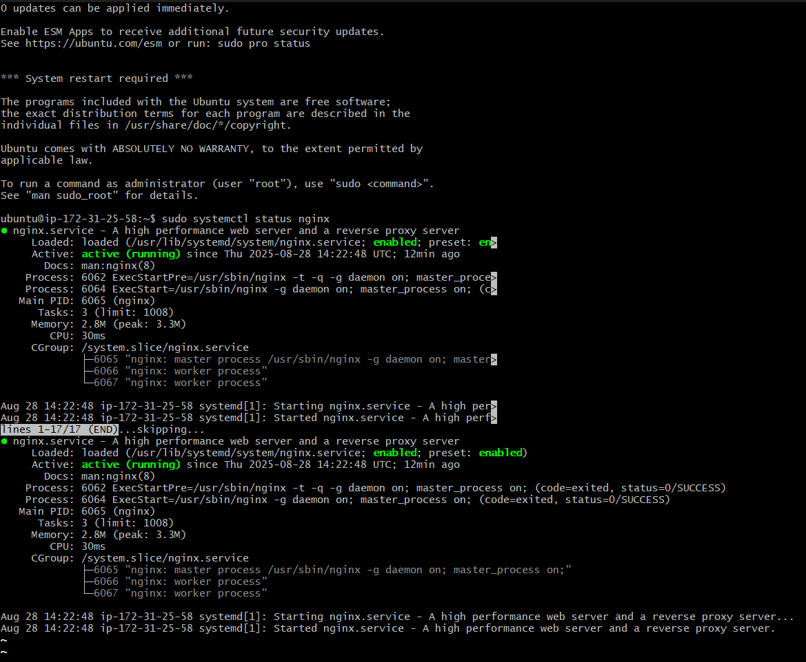
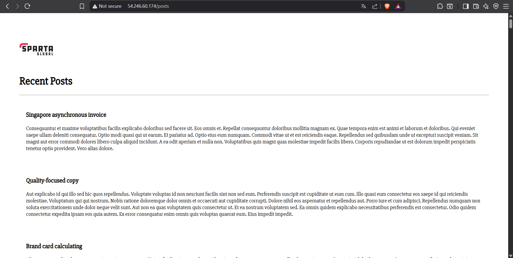
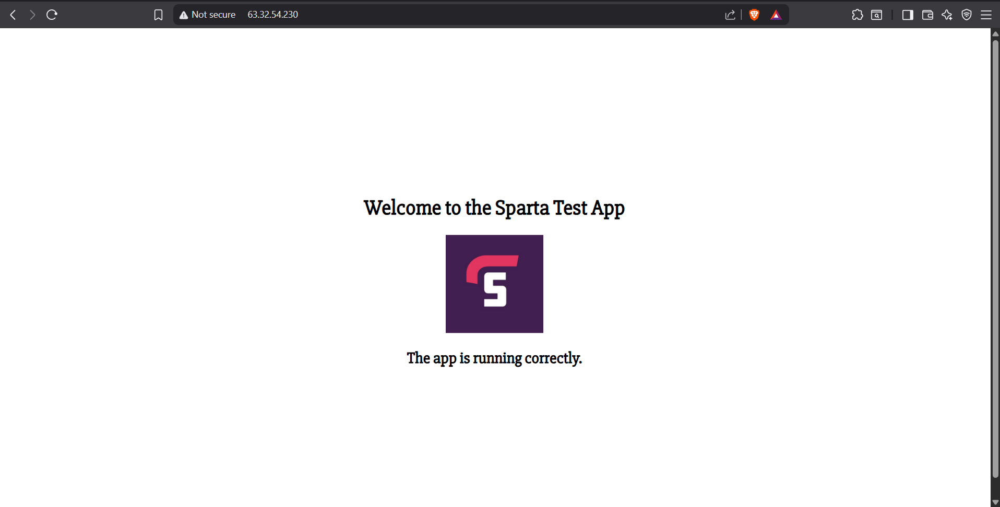
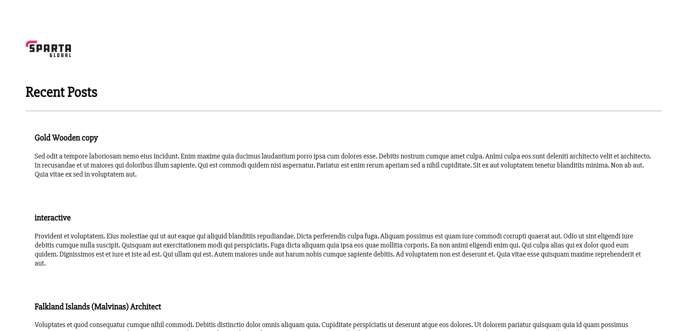

<!-- TOC -->
* [Automate User Data Level 3](#automate-user-data-level-3)
  * [1. Launch a New App Database Instance](#1-launch-a-new-app-database-instance)
  * [Connect to DB Instance](#connect-to-db-instance)
  * [2. Launch a New App Instance](#2-launch-a-new-app-instance)
  * [Connect to App Instance](#connect-to-app-instance)
  * [3. Documentation for AMI Creation](#3-documentation-for-ami-creation)
  * [Create DB AMI](#create-db-ami)
  * [Create App AMI](#create-app-ami)
  * [4. Launch Instances from AMIs](#4-launch-instances-from-amis)
  * [Database Image](#database-image)
  * [App Image](#app-image)
  * [Advanced Settings - User Data Script](#advanced-settings---user-data-script)
<!-- TOC -->
# Automate User Data Level 3

## 1. Launch a New App Database Instance
- **Name**: `tech508-rubaet-sparta-app-db`
- **AMI**: Ubuntu 22.04 LTS
- **Key Pair**: Use your designated key pair
- **Security Group**: `tech508-rubaet-sparta-app-db-SSH`
  - **Inbound Rules**:
    - SSH (22) from `0.0.0.0/0`
    - Custom TCP (Port Range: 27017, Description: SPARTA APP) from `0.0.0.0/0`
- **Advanced Settings**:
  - Scroll to bottom and paste `prov-db.sh` script
- **Launch the Instance**
````bash
# MongoDB Provisioning Script
# This script:
#  Updates the system
#  Installs MongoDB 7.0 (specific version)
#  Imports the MongoDB GPG key
#  Adds the MongoDB APT repository
#  Configures MongoDB to allow external connections
#  Starts and enables the MongoDB service


#!/bin/bash
 
#Scipt for the database
 
# Update the package list to make sure the latest versions are installed
echo "update..."
sudo DEBIAN_FRONTEND=noninteractive apt-get update
echo "update done"
echo
 
echo "upgrade..."
sudo DEBIAN_FRONTEND=noninteractive apt upgrade -y
echo "upgrade done"
echo
 
sudo DEBIAN_FRONTEND=noninteractive apt-get install gnupg curl
 
echo "import public key"
curl -fsSL https://www.mongodb.org/static/pgp/server-7.0.asc | \
gpg --dearmor | sudo tee /usr/share/keyrings/mongodb-server-7.0.gpg > /dev/null
echo "imported public key"
echo
 
#create list file
echo "deb [ arch=amd64,arm64 signed-by=/usr/share/keyrings/mongodb-server-7.0.gpg ] https://repo.mongodb.org/apt/ubuntu jammy/mongodb-org/7.0 multiverse" | sudo tee /etc/apt/sources.list.d/mongodb-org-7.0.list
 
sudo DEBIAN_FRONTEND=noninteractive apt-get update
 
#install mongodb
sudo DEBIAN_FRONTEND=noninteractive apt-get install -y \
   mongodb-org=7.0.22 \
   mongodb-org-database=7.0.22 \
   mongodb-org-server=7.0.22 \
   mongodb-mongosh \
   mongodb-org-shell=7.0.22 \
   mongodb-org-mongos=7.0.22 \
   mongodb-org-tools=7.0.22 \
   mongodb-org-database-tools-extra=7.0.22
 
   echo
echo " Configuring MongoDB to Allow External Connections"
echo
 
# Backup existing config
sudo cp /etc/mongod.conf /etc/mongod.conf.bk
 
# Update bindIp to 0.0.0.0
sudo sed -i 's/bindIp: 127.0.0.1/bindIp: 0.0.0.0/' /etc/mongod.conf
echo "bindIp updated to 0.0.0.0"
echo
 
echo
echo " Starting MongoDB..."
echo
sudo systemctl start mongod
sudo systemctl enable mongod
 
echo
echo
echo " MongoDB provisioned and running "
echo

---
````
## 2. Launch a New App Instance
- **Name**: `tech508-rubaet-test-sparta-app`
- **AMI**: Ubuntu 22.04 LTS
- **Key Pair**: Use your designated key pair
- **Security Group**: `tech508-rubaet-sparta-app-SSH`
  - **Inbound Rules**:
    - SSH (22) from `0.0.0.0/0`
    - HTTP (80) from `0.0.0.0/0`
    - Custom TCP (Port Range: 3000, Description: SPARTA APP) from `0.0.0.0/0`
- **Advanced Settings**:
  - Scroll to bottom and paste `prov-app.sh` script
  - **IMPORTANT**: Paste the **private IP** from the **DB instance** into the `export DB_HOST` section of the script
- **Launch the Instance**

````bash
#!/bin/bash

# What this script does (in plain English):
# - Updates the server and installs NGINX (the web server).
# - Turns NGINX into a "reverse proxy" that forwards port 80 → 3000.
# - Installs Node.js 20.
# - Downloads the app code, enters the app folder, and sets DB_HOST.
# - Installs NPM packages.
# - Installs PM2 and starts the app in the background so it keeps running.
#
# You can run this with:  bash app.sh
# (Code below stays exactly the same; only these comments explain it.)


# Provision (basic setup logs so you can see progress)
echo "update..."
sudo DEBIAN_FRONTEND=noninteractive apt-get update
echo "update done"
echo

echo "upgrade..."
sudo DEBIAN_FRONTEND=noninteractive apt upgrade -y
echo "upgrade done"
echo

# Install NGINX (we’ll use it as the reverse proxy)
echo "install ngnix..."
sudo DEBIAN_FRONTEND=noninteractive apt install nginx -y
echo "nginx install complete"
echo

# Keep a backup of the default NGINX site config (handy if you need to undo)
sudo cp /etc/nginx/sites-available/default /etc/nginx/sites-available/default.bak

# Change the default site so every request on port 80 is forwarded to the app on port 3000
sudo sed -i '/^\s*try_files/c\        proxy_pass http://localhost:3000;' /etc/nginx/sites-available/default

# Apply the NGINX change
sudo systemctl restart nginx

# Install Node.js 20 from NodeSource, then the nodejs package
echo "install node.js..."
sudo DEBIAN_FRONTEND=noninteractive bash -c "curl -fsSL https://deb.nodesource.com/setup_20.x | bash -" && \
sudo DEBIAN_FRONTEND=noninteractive apt-get install -y nodejs
echo "node.js install complete"
echo

# Pull down your app code into a folder named "repos"
echo "cloning git..."
git clone https://github.com/rubaet12/sparta.git repos
echo "git cloning complete"
echo

# Move into the app folder (where package.json lives)
echo
cd repos/app
echo "changed to app directory"

# Set the database connection for this shell
# NOTE: This uses a PUBLIC IP. In AWS, it’s usually better to use the DB’s PRIVATE IP (172.31.x.x).
echo
export DB_HOST=mongodb://54.246.53.210:27017/posts
echo "DB_HOST is set"
echo

# Install Node dependencies (this may also run seed scripts if defined)
echo "installing npm..."
npm install
echo "npm install complete"
echo

# Install PM2 globally so the app can run in the background and auto-restart
# If you get a permissions error here, re-run with:  sudo npm install -g pm2
echo "installing pm2..."
npm install -g pm2
echo "pm2 install complete"
echo

# If a PM2 process with this old name exists, remove it (avoids duplicates on reruns)
echo "Ensuring pm2 process idempotent"
pm2 delete sparta-app || true
echo

# Start the app via PM2 using the "npm start" script and save the process list
echo "Starting app..."
pm2 start npm --name "rubaet-manual-sparta-app" -- start
pm2 save
echo "App has started in background!"
echo


````

## Connect to App Instance
```bash
# Open Git Bash terminal
cd .ssh
chmod 400 "tech508-rubaet-aws.pem"
ssh -i "tech508-rubaet-aws.pem" ubuntu@ec2-34-244-208-198.eu-west-1.compute.amazonaws.com
sudo systemctl status nginx  # Check if NGINX is running
```
**Screenshot of the output in the terminal to check if NGINX is running which is**



- Copy **public IP** and paste it into browser (start with `http://`)
- Append `/posts` to the URL to check functionality

---

**front page**


**posts page**



## 3. Documentation for AMI Creation

## Create DB AMI
1. Go to **Instances > Actions > Image and Templates > Create Image**
2. Name: `tech508-rubaet-test-sparta-app-ready-to-run-database`
3. Add Tag:
   - **Key**: `Name`
   - **Value**: `tech508-rubaet-test-sparta-app-ready-to-run-database`
4. Click **Create Image**

## Create App AMI
1. Go to **Instances > Actions > Image and Templates > Create Image**
2. Name: `tech508-rubaet-test-sparta-app-ready-to-run-app`
3. click on "Tag image and snapshots separately"
3. Add Tag:
   - **Key**: `Name`
   - **Value**: `tech508-rubaet-test-sparta-app-ready-to-run-app`
4. Click **Create Image**

---

## 4. Launch Instances from AMIs

## Database Image
1. Go to **Images > AMIs**
2. Select **database AMI** and launch an instance
3. **Name**: `tech508-rubaet-test-sparta-app-db-image`
4. **Security Group**: `tech508-rubaet-sparta-app-db-Image-SSH`
   - **Inbound Rules**:
     - SSH (22) from `0.0.0.0/0`
     - Custom TCP (27017, Description: SPARTA APP) from `0.0.0.0/0`
     - Click launch instance 

## App Image
1. Select **app AMI** and launch an instance
2. **Name**: `tech508-rubaet-test-sparta-app-image`
3. **Key Pair**: Use your designated key pair
4. **Security Group**: `tech508-rubaet-sparta-app-SSH`
   - **Inbound Rules**:
     - SSH (22) from `0.0.0.0/0`
     - HTTP (80) from `0.0.0.0/0`
     - Custom TCP (3000, Description: SPARTA APP) from `0.0.0.0/0`

## Advanced Settings - User Data Script
```bash
#!/bin/bash
export DB_HOST=mongodb://172.31.21.64:27017/posts  # Replace with private IP of DB instance (ami one)
cd repo/app
pm2 start app.js
```
   - After click launch instance 
**Output**




- **IMPORTANT**: Make sure to update `DB_HOST` with the actual **private IP** of the **DB instance**
- Copy **public IP** and check in browser using `http://<public-ip>/posts`
