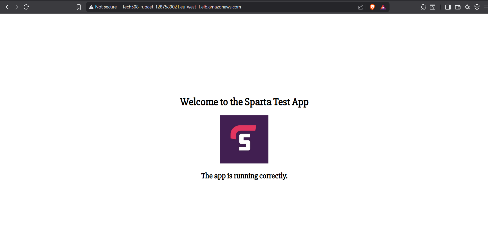

# Auto-scaling with AWS

- [Auto-scaling with AWS](#auto-scaling-with-aws)
  - [Scaling](#scaling)
  - [Types of scaling](#types-of-scaling)
    - [Vertical](#vertical)
      - [Sizing terminology:](#sizing-terminology)
    - [Horizontal](#horizontal)
      - [Sizing terminology:](#sizing-terminology-1)
  - [Deploying the Sparta app with an AWS auto-scaling group](#deploying-the-sparta-app-with-an-aws-auto-scaling-group)
    - [Basic overview](#basic-overview)
    - [Creating a launch template](#creating-a-launch-template)
    - [Creating an auto-scaling group](#creating-an-auto-scaling-group)
      - [Choosing a launch template or configuration](#choosing-a-launch-template-or-configuration)
      - [Choosing instance launch options](#choosing-instance-launch-options)
      - [Integrating with other services](#integrating-with-other-services)
      - [Configuring group size and scaling](#configuring-group-size-and-scaling)
      - [Adding notifications](#adding-notifications)
      - [Adding tags](#adding-tags)
      - [Reviewing ASG before creation](#reviewing-asg-before-creation)
  - [Checking that the app is functioning](#checking-that-the-app-is-functioning)
  - [Deleting an auto-scaling group](#deleting-an-auto-scaling-group)
    - [Deleting an ASG](#deleting-an-asg)
    - [Deleting a load balancer](#deleting-a-load-balancer)
    - [Deleting a target group](#deleting-a-target-group)


## Scaling

(diagram to go here: worse method > better method)

## Types of scaling

### Vertical

Vertical scaling increases the size of the VM. This can include the CPU, RAM and storage.
The workload is migrated from a smaller machine to a larger one, after which the smaller machine is removed. Depending on provider, it can be difficult to scale back down using this method.

#### Sizing terminology:
- Up (make bigger)
- Down (make smaller)

### Horizontal

(Method used by AWS)

Horizontal scaling increased number of machines. It makes as many VMs as needed – these are usually identical to the original – up to a specified maximum. When auto-scaling, this method removes excess machines once they are no longer needed. 

#### Sizing terminology: 
- In (remove machines)
- Out (add machines)


## Deploying the Sparta app with an AWS auto-scaling group

This set of instructions allows for high availability and scalability for the app. It does not provide instructions for using the app with the database.

### Basic overview

1. Create an app VM with your preferred method
2. Create an app AMI
3. Create a launch template (including user data containing the script needed to run the app)
4. Create an auto-scaling group using the launch template
5. Set up a scaling policy
   - To avoid a single point of failure
     - Have the auto-scaler spread the new VMs across availability zones within the region
     - For the Sparta test app, use the Ireland region and availabiliy zones 1a, 1b, 1c
     - The load balancer will spread traffic across the created VMs
   - Set a max, min and desired number of machines
     - For the sparta app, set the min and desired to 2 and the max to 3


### Creating a launch template

1. In the EC2 sidebar, go to <font color=darkseagreen>Instances</font> > <font color=darkseagreen>Launch Templates</font>
2. In the top right-hand corner, click <font color=orange>Create launch template</font>
3. Give the template a descriptive name using the standard naming convention
   - It should start with `tech508-rubaet`
4. (<font color=cadetblue>Optional</font>) Add a description
5. Under <font color=skyblue>Application and OS Images (Amazon Machine Image)</font>, select <font color=mediumslateblue>My AMIs</font> > <font color=mediumslateblue>Owned by me</font>, then search for the appropriate AMI
6. Select `t3.micro` from the <font color=skyblue>Instance Type</font> drop-down
7. Select the correct key pair from the <font color=skyblue>Key pair (login)</font> drop-down
8. Under <font color=skyblue>Network settings</font>, choose <font color=mediumslateblue>Select existing security group</font>, then search for an appropriate one
   - For the Sparta app, the security group should allow SSH and HTTP
9. Paste the script into the User data box under Advanced details which is this:
   ```
   bash
      #!/bin/bash
      cd repo/app
      pm2 start app.js
   ```
   - _To be updated with an option for a database script later_
10. Click <font color=orange>Create launch template</font> in the <font color=orange>Summary</font> box on the right-hand side

### Creating an auto-scaling group

#### Choosing a launch template or configuration

1. In the EC2 sidebar, go to <font color=darkseagreen>Auto Scaling</font> > <font color=darkseagreen>Auto Scaling Groups</font>
2. In the top right-hand corner, click <font color=orange>Create Auto Scaling group</font>
3. Give the auto-scaling group (ASG) a descriptive name using the standard naming convention
   - It should start with `tech508-rubaet`
4. Search for the launch template that VMs in the ASG should be based on
5. Click <font color=orange>Next</font>

#### Choosing instance launch options

1. In the <font color=skyblue>Network</font> box, under <font color=skyblue>Availability Zones and subnets</font>, search for and select the following three options:
   - DevOpsStudent default 1a
   - DevOpsStudent default 1b
   - DevOpsStudent default 1c
2. Choose <font color=mediumslateblue>Balanced best effort</font> under <font color=skyblue>Availability Zone distribution</font>
   - This should be selected by default
3. Click <font color=orange>Next</font>

#### Integrating with other services

1.  Select <font color=mediumslateblue>Attach to a new load balancer</font> under <font color=skyblue>Load balancing</font>
2. To create the load balancer, do the following:
    1. Select <font color=mediumslateblue>Application Load Balancer</font> as the load balancer type
    2. Set the name to something descriptive that follows the same naming convention as the ASG
    3. Select <font color=mediumslateblue>Internet-facing</font> as the load balancer scheme
    4. Create a new target group for default routing under <font color=mediumslateblue>Listeners and routing</font>, and give it a descriptive name
    5. Under <font color=skyblue>Health Checks</font> tick <font color=mediumslateblue>Turn on Elastic Load Balancing health checks</font>
    6. Set the <font color=mediumslateblue>Health check grace period</font> to at least 180 seconds
3. Click <font color=orange>Next</font>

#### Configuring group size and scaling

1. Set the <font color=mediumslateblue>Desired capacity</font> to 2
2. Set the <font color=mediumslateblue>Min desired capacity</font> and <font color=mediumslateblue>Max desired capacity</font> to 2 and 3, respectively
3. Select <font color=mediumslateblue>Target tracking scaling policy</font>
4. Set the <font color=mediumslateblue>Instance warmup</font> to at least 180 seconds
5. Click <font color=orange>Next</font>

#### Adding notifications

1. (<font color=cadetblue>Optional</font>) Set up notifications
2. Click <font color=orange>Next</font>

#### Adding tags

1. Add a Name tag (case sensitive; the key must have initial caps), setting the value to a descriptive name
2. Click <font color=orange>Next</font>

#### Reviewing ASG before creation

1. <font color=crimson>IMPORTANT</font>: Review all details
2. If anything needs to be changed, click the <font color=deepskyblue>Edit</font> button at the top right of the section that needs changing
    - If necessary, edits *can* be made after creating the ASG
3. Once everything is correct, click <font color=orange>Create Auto Scaling group</font>

## Checking that the app is functioning

1. In the EC2 sidebar, go to <font color=darkseagreen>Load balancing</font> > <font color=darkseagreen>Load Balancers</font>
2. Select the load balancer
3. Copy the <font color=darksalmon>DNS name</font> and paste it into a browser
4. If the app loads, the ASG is working as intended
5. http://tech508-rubaet-1287589021.eu-west-1.elb.amazonaws.com/
6. 

## Deleting an auto-scaling group

__The load balancer and terget group must be deleted separately.__ 

### Deleting an ASG

1. From the list of ASGs, select the ASG to be deleted
2. Click <font color=deepskyblue>Actions</font> > <font color=lightcoral>Delete</font>
3. Type "delete" in the box to confirm deletion
4. Click <font color=orange>Delete</font>

### Deleting a load balancer

5. From the list of load balancers, select the load balancer to be deleted
6. Click <font color=deepskyblue>Actions</font> > <font color=lightcoral>Delete load balancer</font>
7. Type "confirm" in the box to confirm deletion
8. Click <font color=orange>Delete</font>

### Deleting a target group

9.  From the list of target groups, select the target group to be deleted
10. Click <font color=deepskyblue>Actions</font> > <font color=lightcoral>Delete</font>
11. Click <font color=orange>Delete</font>