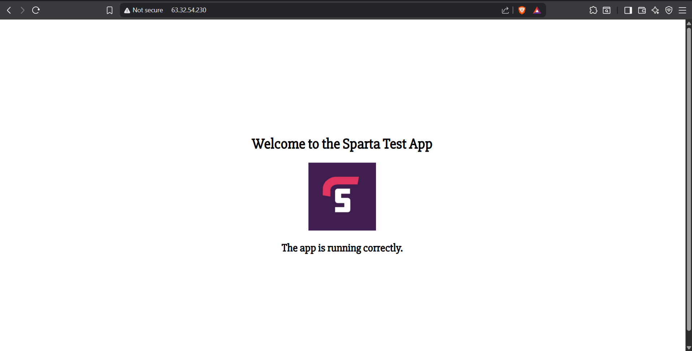

<!-- TOC -->
* [Creating and using a CICD pipleline with Jenkins](#creating-and-using-a-cicd-pipleline-with-jenkins)
  * [General usage information](#general-usage-information)
  * [Creating and testing a basic project (get date and time)](#creating-and-testing-a-basic-project-get-date-and-time)
    * [Creation](#creation)
    * [Testing](#testing)
  * [Creating second project in jenkins: (repeat the same steps as above)](#creating-second-project-in-jenkins-repeat-the-same-steps-as-above)
  * [link  both project( to run one after other):](#link--both-project-to-run-one-after-other)
  * [Creating a jenkins key pair:](#creating-a-jenkins-key-pair)
* [Creating Job 1,2 and 3.](#creating-job-12-and-3)
  * [creating job 1](#creating-job-1)
  * [Creating a webhook:](#creating-a-webhook)
  * [Job2 CI merge task:](#job2-ci-merge-task)
  * [Job 3 creation](#job-3-creation-)
    * [Advanced Settings - User Data Script](#advanced-settings---user-data-script)
  * [Worst case Scenarios](#worst-case-scenarios-)
  * [Lets check if the pipelines are working correctly.](#lets-check-if-the-pipelines-are-working-correctly)
  * [How to change the images](#how-to-change-the-images)
<!-- TOC -->

# Creating and using a CICD pipleline with Jenkins

## General usage information

- Everything on Jenkins is called a "project", regardless of the actual project type
- There are several people using the same Jenkins server, so to prevent confusion, all project names should begin with "rubaet"
- For the same reason, the settings found under Manage Jenkins should not be changed

## Creating and testing a basic project (get date and time)

### Creation
1. Click **New Item** in the sidebar
2. Enter a descriptive project name
   - For this example, use `rubaet-get-date-and-time`
3. Select Freestyle Project, then click OK
4. It will take you to the configure page
5. Enter a description in the box type "testing jenkins"
5. Tick the box next to Discard old builds, then specify a maximum number of old builds to keep
   - For this example, choose 5
6. Scroll down to Build Steps
7. Click Add build steps, and select Execute shell from the drop-down
8. inside the Execute Shell write "uname -a " to find linux name .
9. Click Save
10. You can check console output to see output


### Testing
1. From the Dashboard, click the arrow that appears when hovering over the project name
2. Click Build Now
3. Once the build has been executed (Build Executor Status in the sidebar), click the project to go to the project page
   - If there are no worker instances spun up, this may take a few minutes, but will be very fast if there are instances available
5. Refresh the Dashboard and check the icons next to the project
   - A successful build will have a green tick and a sun icon to the left of the name
6. From the project page, click the build in the Build History in the sidebar
   - It will be numbered and have a date and time (e.g. Sep 1, 2025, 8:49:56 AM)
7. Click Console Output
   - This will show a log of what happened while the build was running and can be used to check for any issues


## Creating second project in jenkins: (repeat the same steps as above)

1) First on the dashoboard click " New item"
2) Give a unique name "rubaet-second-project"
3) click freestyle project
4) click ok
5) It will take you to the configure page
6) On the description column "testing jenkins"
7) On the discard old build choose max of "5"
8) Go to build steps and click execute shell
9) inside the execute Shell Write "date " to find date from linux .
10) click save
11) click build now.
12) You can check console output to see output


## link  both project( to run one after other):
 
1) Go to first project in jenkins for my case it would be "Project rubaet-get-date-and-time"
2) click configure
3) Go to post build actions
4) Select Projects to Build
5) Enter the second project name you have created before "rubaet-second-project"
6) save -make sure to have "Trigger only if build is stable"
7) click build now
8) you can notice the first build will run and when it is successful the second build will run and you can check it in console output.
9) you can also what triggered the next job.


## Creating a jenkins key pair:
 
1) Create a key pair for jenkins to access github.- got to gitbash. Cd into your ssh folder 
2) Command " ssh-keygen -t rsa -b 4096 -c "mohammedrubaet07440@gmail.com"
3) Enter the file name:rubaet-jenkins-to-github-key
4) Hit enter and no passpharse
5) You have generate public and private key.
6) ls and check whether you can see both
7) Go to github and go to sparta-test-app-cicd by creating a new repo with the app folder inside On account, press setting
8) On the setting go to deploy keys.
9) Add deploy key
10) Give the exact same name we give on ssh keys "rubaet-jenkins-to-github-key"
11) cat "rubaet-jenkins-to-github-key.pub" public key confidential private key 
12) copy the key and paste it on the box.
13) click allow write access and add key.
14) You have successfully created jenkins key pairs


# Creating Job 1,2 and 3.
## creating job 1
 
1) Login to jenkins using credentials and click enter new item
2) Enter an item name " rubaet-job1-ci-test"
3) Click freestyle project
4) Click ok.
5) In the description enter "job 1 - tests code on dev branch"
6) Discard old builds -Max -5
7) Go to Github project
8) Inside the project url give "Https endpoint from github repo"
   - https://github.com/rubaet12/sparta-test-app-cicd/
   - You can copy paste from the "codesection" of github repo the URL which HTTPs. ,remove the .git from the end while pasting and put /.
9) Go to source code management.
10) Click Git
11) In the repository URL enter the "SSH url of the github repo"

    - You can copy paste from the "codesection" of github repo the URL which SSH.
12) Under the credential choose add, this will open a separate window, under kind choose "SSH username with private key"
13) In ID column give the name of key "rubaet-jenkins-to-github-key"
14) Copy and paste the same in username as well
15) In Description column give "to read/write to the repo"
16) Click on private key and click on "ADD"
17) cat "rubaet-jenkins-to-github-key" and copy the key from the gitbash
18) Paste it and click add.
19) Now if you can see your key in GIT on the main page click your name.
20) Under branches to build : Change "*/dev" 
21) Tick GitHub hook trigger for GITScm polling
```
Install the NodeJS Plugin
In Jenkins, go to Manage Jenkins → Plugins → Available plugins.
Search for NodeJS.
Configure NodeJS (Global Tool)
Go to Manage Jenkins → Tools.
Scroll to NodeJS installations → click Add NodeJS.
Give it a name (e.g. nodejs-20).
Choose the version 20.x from the dropdown.
Save.
```
22) Under Build environment Choose "Provide node and npm bin/folder to path"
23) Choose "nodejs version 20"
24) click save
25) Click Build steps and choose "Execute shell"
26) Inside execute shell write
    * cd app
    * npm install
    * npm test
27) Click save.
28) The creation of job 1 is completed.


## Creating a webhook:
 
How to set up webhook:
 
1) In the github repository go to your sparta-test-app-cicd and click setting
2) On the left you can see webhook. Click add webhook
3) In the payload section copy and paste the jenkins URL which you are using followed by github-webhook/ "http://34.254.6.118:8080/github-webhook/"
4) click and save.

## Job2 CI merge task:
 
1) log into jenkins and add new item and name "rubaet-job2-ci-merge"
2) Click freestyle and click ok
3) On the description give unique name "CI pipelinejob2 merge dev branch to main"
4) On discard old builds - 5
5) Under github project give github url (go to github repo and copy the url from code section-https) https://github.com/rubaet12/sparta-test-app-cicd/ and remove .git put / at the end 
6) Under the source code management choose git
7) Under repositories give ssh url (like the same you copied earlier from github on the previous section. now copy ssh url) git@github.com:rubaet12/sparta-test-app-cicd.git
8) Choose the credentials  which we have created (rubaet-jenkins-to-github-key)
9) Under branches to build :
    * Branch specifier - */main
    * repository browser: leave default (auto)
    * Additional behaviours-
    * Name of repository: origin
    * branch to merge: dev
    * merge strategy: default
    * fast-forward mode: --ff(default)
 

10) Under Build triggers
    * Choose build after other projects are built
    * choose "rubaet-job1-ci-test"
11) Build environment - SSH agent
12) Build steps: leave default
13) post build actions:
    * choose push only if build succeds
    * Merge results
    * force push
    * Branches: Branch to push: main
    * target remote name : origin
 
  
14) click save
   
15) Now click build now
     
16) You can notice job1 will test and run , then job2 will start.


## Job 3 creation 
1) Login to jenkins using credentials and click enter new item
2) Enter an item name " rubaet-job3-cd-deploy"
3) Click freestyle project
4) Click ok.
5) In the description enter "job 3 run all"
6) Discard old builds -Max -5
7) Go to Source Code Management
8) tick Git
9) On Repository URL box 
10) Make sure you keep Repository URL exaclty the same 
11) In the repository URL enter the "SSH url of the github repo"
12) this is mine git@github.com:rubaet12/sparta-test-app-cicd.git
13) Select Credentials: rubaet-jenkins-to-github-key
14) Branch Specifier: "*/main"
15) on the Build Triggers select the box "Build after other projects are built"
16) Projects to watch
17) select the project rubaet-job2-ci-merge 
18) select Trigger only if build is stable box 
19) on the Build Environment select "Add timestamps to the Console Output" 
20) SSH Agent-> Credentials -> rubaet-aws-key
21) Scroll down to Build steps 
22) On the Execute shell
23) Enter the following command:
``` Bash
ssh -o StrictHostKeyChecking=no ubuntu@ec2-18-201-112-14.eu-west-1.compute.amazonaws.com "echo connected"
 
scp -o StrictHostKeyChecking=no -r $WORKSPACE/* \
    ubuntu@ec2-18-201-112-14.eu-west-1.compute.amazonaws.com:~/repo
 
ssh -o StrictHostKeyChecking=no ubuntu@ec2-18-201-112-14.eu-west-1.compute.amazonaws.com << 'EOF'
	cd ~/repo/app
    npm install
    pm2 stop all || true
    pm2 start app.js --name sparta
EOF
```
24) Now you have to create an AMI to do this 
- 1. Select **app AMI** and launch an instance
- 2. **Name**: `tech508-rubaet-jenkins-run-ami`
- 3. **Key Pair**: Use your designated key pair
- 4. **Security Group**: `tech508-rubaet-sparta-app-SSH`
   - **Inbound Rules**:
     - SSH (22) from `0.0.0.0/0`
     - HTTP (80) from `0.0.0.0/0`
     - Custom TCP (3000, Description: SPARTA APP) from `0.0.0.0/0`
     - Alternatively if you already have your Security Group then select your app one 
### Advanced Settings - User Data Script
```bash
#!/bin/bash
cd repo/app
pm2 start app.js
```
   - After click launch instance 
**Output**

 
- 5. Perfect the AMI works correctly!
- 6. Got to your instance summary of your AMI 
- 7. Copy the public DNS
25) go to your code and paste it on your Shell Script your public DNS
26) Click save and run 
25) Job 3 Runs successfully. 

## Worst case Scenarios 
1) After Doing all the steps and you run job 3 but you get an error then do the following:
   - Check if you have entered your public DNS correctly from your AMI
   - Check for any spelling error 
   - if the problem persist then diagnose the issue manually. 
2) Connect your AMI to your Gitbash
3) CD into your SSH folder 
4) Go to your tech508-rubaet-jenkins-run-ami click connect 
5) copy the chmod command and paste into your gitbash 
6) chmod 400 "tech508-rubaet-aws.pem"
7) ssh -i "tech508-rubaet-aws.pem" root@ec2-18-201-112-14.eu-west-1.compute.amazonaws.com
8) Because we are connecting the AMI to your gitbash change root to ubuntu
9) ssh -i "tech508-rubaet-aws.pem" ubuntu@ec2-18-201-112-14.eu-west-1.compute.amazonaws.com

- 

10) Hit ls to check if your folder "repo" exist this folder contains your project file 
11) If you can't see the "repo" folder then make one 
12) Go back to your source code on your Shell script 
13) At the top line "ssh -o StrictHostKeyChecking=no ubuntu@ec2-18-201-112-14.eu-west-1.compute.amazonaws.com "echo connected""
14) Replace "echo connected" to "mkdir repo"- what this does is it creates a folder called repo and it does the git clone to that folder called repo 
15) Click build now and the Shell script will create a folder called repo 
16) To verify this go back to your gitbash and hit ls again. You should see the folder called repo 
17) Cd into your folder repo and then ls to check if your app content is there

 

18) Go back to your jenkins 

 

19) As you can see I have managed to successfully run the code and fixed it.
20) Go to AWS and go to the instance 
21) Click on open address remove s from https to be http to see the code output.

## Lets check if the pipelines are working correctly.

1) Open a separate gitbash 
2) cd to your tech508-cicd-with-jenkins
3) ls and then cd to app folder 
4) ls and then cd to a folder called views 
5) ls and nano into folder called index.ejs
6) you should see the following code: 
```` 
htlm code:
 
 "width: 150px;
    }
  </style>
</head>
<body>
  <div class="vertical-center">
    <h1>Hi I'm Rubaet Welcome to the Sparta Test App</h1>
    
    <h2>The app is running correctly with jenkins.</h2>

  </div>
</body>
</html>"**
````
7) Scroll down and you can edit the letters , words etc 
8) Once done hit ctrl + S to save and then ctrl + X to save and exit the nano file 
9) Now the fun part: Do the git push and push the changes you made into your github repo folder
10) Lets do it together:
````
# 1. Check what has changed
git status

# 2. Add the changed file(s) to staging
git add filename          # for one file
git add .                 # for all files

# 3. Commit your changes with a message
git commit -m "your message here"

# 4. Push to your repo (main branch is common, but check yours)
git push origin main
````
11) Now go to jenkins and run job 3 again 
12) Refresh the provisional page 
13) You should see changes 


- **My pipeline is working correctly!**

## How to change the images
1) Very easy! Open visual code studio on to your github folder 
2) Drag the file to the image and then on the image name replace it with the image file name .jpg by opening the index.ejs folder 
3) do the git add and then run job 3 again and refresh the page 


