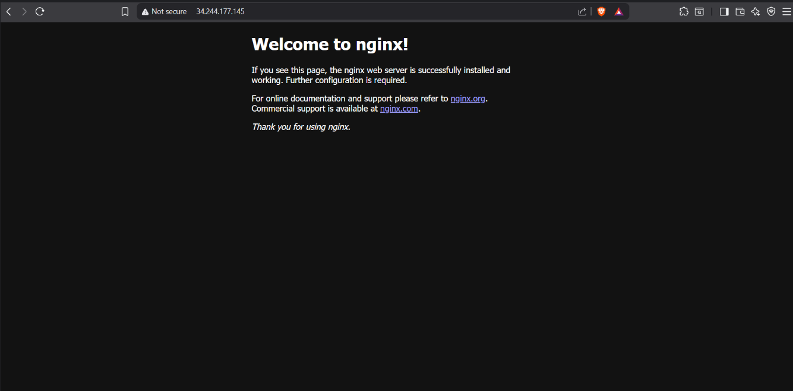
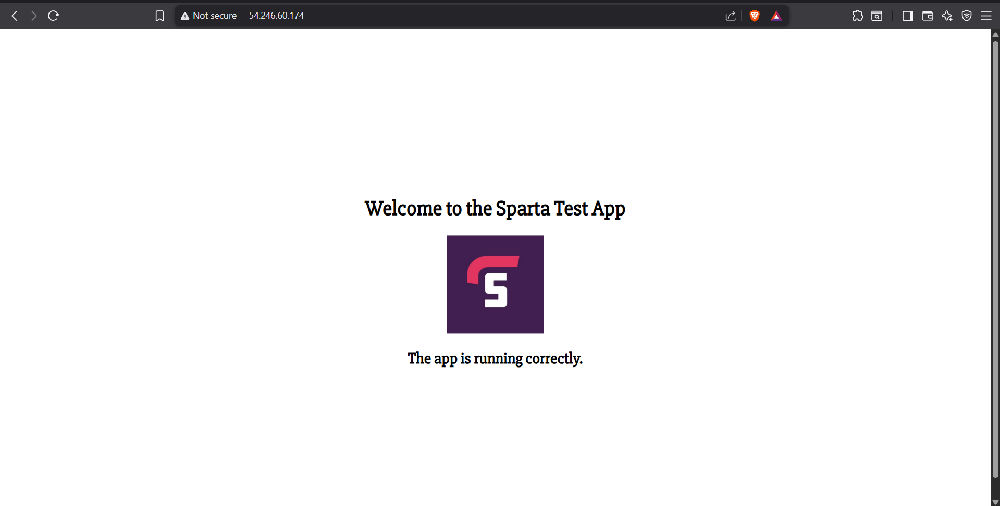
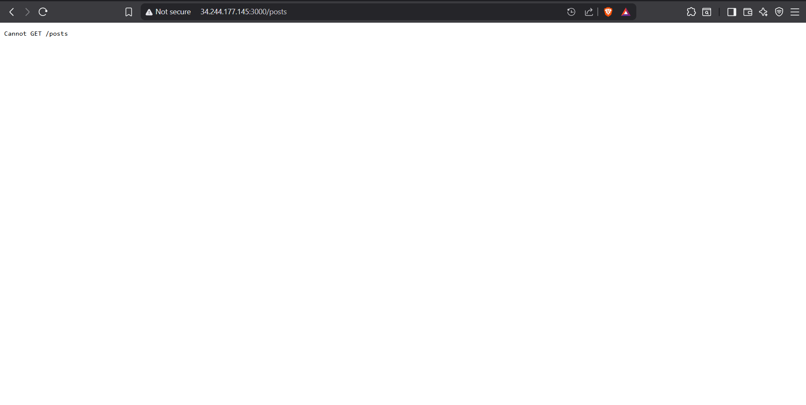
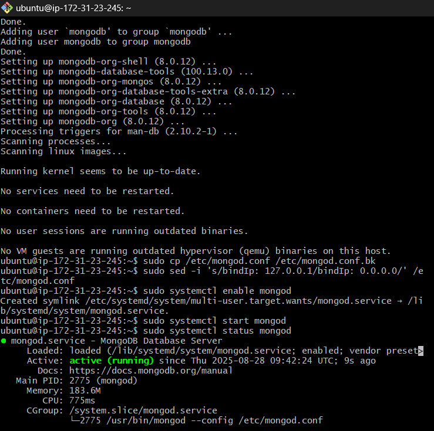
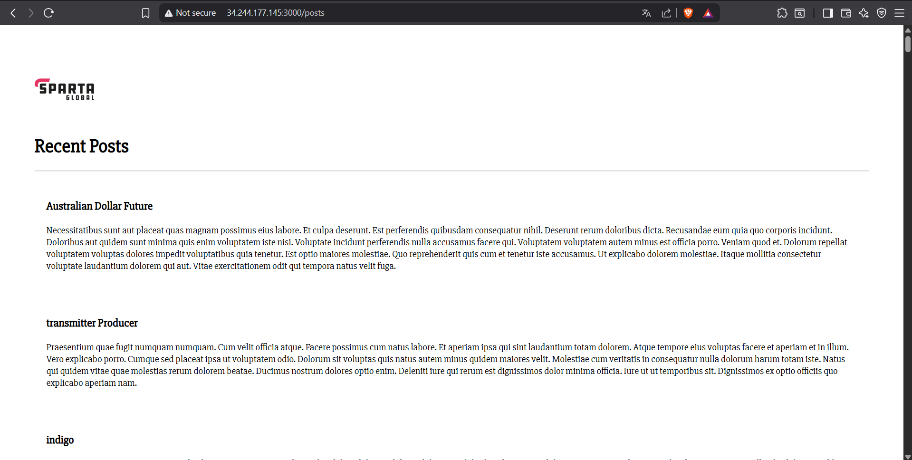
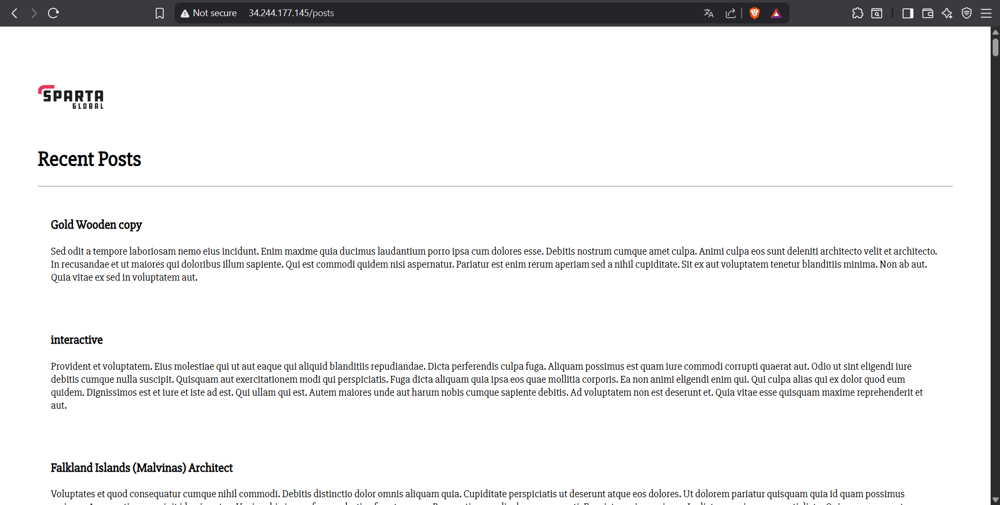

<!-- TOC -->
* [The manual to setting up the sparta app via AWS](#the-manual-to-setting-up-the-sparta-app-via-aws)
* [Setting Up a Full Web App Using Two AWS EC2 Instances (Frontend + Backend)](#setting-up-a-full-web-app-using-two-aws-ec2-instances-frontend--backend)
  * [Part 1: Set Up the Frontend Application (Sparta App)](#part-1-set-up-the-frontend-application-sparta-app)
    * [Step 1: Launch AWS EC2 Instance for Frontend](#step-1-launch-aws-ec2-instance-for-frontend)
    * [Step 2: Connect to the Frontend VM Using Git Bash](#step-2-connect-to-the-frontend-vm-using-git-bash)
    * [Step 3: Install Required Software on Frontend VM](#step-3-install-required-software-on-frontend-vm)
    * [Step 4: Download and Run the App](#step-4-download-and-run-the-app)
    * [Step 5: Check If the App Works](#step-5-check-if-the-app-works)
  * [Part 2: Set Up the Backend Database (MongoDB)](#part-2-set-up-the-backend-database-mongodb)
    * [Step 6: Launch AWS EC2 Instance for MongoDB](#step-6-launch-aws-ec2-instance-for-mongodb)
    * [Step 7: Connect to MongoDB VM Using Git Bash](#step-7-connect-to-mongodb-vm-using-git-bash)
    * [Step 8: Install MongoDB on the Database VM](#step-8-install-mongodb-on-the-database-vm)
    * [Step 9: Allow Remote Access to MongoDB](#step-9-allow-remote-access-to-mongodb)
  * [Part 3: Link Frontend with Backend](#part-3-link-frontend-with-backend)
    * [Step 10: Connect the App to the MongoDB Database](#step-10-connect-the-app-to-the-mongodb-database)
  * [Final Check](#final-check)
  * [What is a Reverse Proxy?](#what-is-a-reverse-proxy)
  * [Implement Reverse Proxy (Access App Without :3000)](#implement-reverse-proxy-access-app-without-3000)
    * [App script](#app-script-)
    * [Database script](#database-script-)
    * [How do you run it?](#how-do-you-run-it)
    * [Test in Your Browser](#3-test-in-your-browser)
    * [Why This Works](#why-this-works)
<!-- TOC -->

# The manual to setting up the sparta app via AWS

#  Setting Up a Full Web App Using Two AWS EC2 Instances (Frontend + Backend)

This guide walks you through how to get a simple full-stack app running. The app has two parts:
1. A **frontend** – what users see when they go to a website
2. A **backend/database** – where the app stores and retrieves data

You will set up **two virtual machines (VMs)** using AWS EC2:
- One for the **Sparta frontend app**
- One for the **MongoDB backend database**

---

## Part 1: Set Up the Frontend Application (Sparta App)

### Step 1: Launch AWS EC2 Instance for Frontend

Go to aws, log in and click **Launch Instance**.

Set the following options:
- **Name:** `tech508-rubaet-test-sparta-app`
- **AMI (Image):** Ubuntu Server 24.04 LTS
- **Key Pair:** Select `tech508_rubaet-aws`
- **Network Settings:** Create a new security group:
  - **Name:** `tech508-name-sparta-app-allow-SSH-HTTP-3000`
  - Allow:
    - **SSH** on port **22** (for connecting)
    after cick on add security 
    - **HTTP** on port **80** (for website access)
    - after click on add security
    - **Custom TCP** on port **3000** (to run the app)

Click **Launch Instance**.

---

### Step 2: Connect to the Frontend VM Using Git Bash

1. In the AWS EC2 console, click your instance name, then click **Connect**.
2. Copy the **SSH command** (it looks like `ssh -i "key.pem" ubuntu@...`).
3. Open **Git Bash** on your computer.
4. Run:
   ```bash
   cd ~/.ssh
   ```
5. Paste and run the **SSH command** you copied. Type `yes` if prompted.

You are now connected to your remote Ubuntu server!

---

### Step 3: Install Required Software on Frontend VM

Now install the necessary tools and run your web app.

Copy and paste the following commands one at a time:

```bash
# Update the system
sudo apt-get update
sudo apt-get upgrade -y

# Install web server software
sudo apt-get install nginx -y

# Install Node.js (used to run the app)
sudo DEBIAN_FRONTEND=noninteractive bash -c "curl -fsSL https://deb.nodesource.com/setup_20.x | bash -" && \
sudo DEBIAN_FRONTEND=noninteractive apt-get install -y nodejs
```

---

### Step 4: Download and Run the App

Run the following commands:

```bash
# Download the app code from GitHub
git clone https://github.com/rubaet12/sparta.git repo

# Go into the app folder
cd repo/tech508-spartaapp

# Install required packages
npm install

# Start the app
npm start
```

If successful, your app is running on port `3000`.

**without the port 3000 you will see nginx is successfully installed which means that app is running correctly and should display like this:**



**When you add ":3000" at the end of the url link you should see the front page of the app running**


---

### Step 5: Check If the App Works

1. Go back to AWS and copy the **Public IPv4 address** of your app instance.
2. Paste it into your browser like this:
   - `http://your-ip` → You’ll see an Nginx welcome page.
   - `http://your-ip:3000` → You’ll see the Sparta app.
   - `http://your-ip:3000/getposts` → Will NOT work yet because we haven’t set up the database.


---

## Part 2: Set Up the Backend Database (MongoDB)

### Step 6: Launch AWS EC2 Instance for MongoDB

Repeat the process from Step 1, but this time:

- **Name:** `tech508-name-test-sparta-app-db`
- **AMI (Image):** Ubuntu Server 22.04 LTS
- click commit changes and scroll down 
- **Key Pair:** Select `tech508_rubaet-aws`
- **Network Settings:** Create a new security group:
  - **Name:** `tech508-rubaet-sparta-app-db-allow-MONGODB`
  - **Description**`tech508-rubaet-sparta-app-db-allow-MONGODB`
  - Allow:
    - **SSH** on port **22**
    - Click on add security group rule
    - **Custom TCP** on port **27017** (MongoDB default port)
    - **Source type put anywhere for the purpose of testing the app. Usually we don't do this in the real world enviroment**

Click **Launch Instance**.

---

### Step 7: Connect to MongoDB VM Using Git Bash

Same process as before:

1. In the AWS EC2 console, click **Connect** on your database instance.
2. Copy the **SSH command**.
3. In Git Bash:
   ```bash
   cd ~/.ssh
   ```
4. Paste and run the command.

---

### Step 8: Install MongoDB on the Database VM

Now we install the MongoDB software:

```bash
# Update the system
sudo apt-get update
sudo apt-get upgrade -y

# Install MongoDB tools
sudo apt-get install gnupg curl

# Add MongoDB repository to your system
echo "deb [ arch=amd64,arm64 signed-by=/usr/share/keyrings/mongodb-server-8.0.gpg ] https://repo.mongodb.org/apt/ubuntu jammy/mongodb-org/8.0 multiverse" | \
sudo tee /etc/apt/sources.list.d/mongodb-org-8.0.list

# Update again to include MongoDB
sudo apt-get update

# Install MongoDB 8.0
sudo apt-get install -y \
mongodb-org=8.0.12 \
mongodb-org-database=8.0.12 \
mongodb-org-server=8.0.12 \
mongodb-mongosh \
mongodb-org-shell=8.0.12 \
mongodb-org-mongos=8.0.12 \
mongodb-org-tools=8.0.12 \
mongodb-org-database-tools-extra=8.0.12
```

---

### Step 9: Allow Remote Access to MongoDB

MongoDB only allows local access by default. We need to change this:

```bash
# Backup config file first
sudo cp /etc/mongod.conf /etc/mongod.conf.bk

# Change bind IP so MongoDB can be accessed from other machines
sudo sed -i 's/bindIp: 127.0.0.1/bindIp: 0.0.0.0/' /etc/mongod.conf
```

Now start MongoDB and enable it to start on boot:

```bash
sudo systemctl enable mongod
sudo systemctl start mongod
sudo systemctl status mongod  # Should say "active (running)"
```


---

## Part 3: Link Frontend with Backend

### Step 10: Connect the App to the MongoDB Database

Now go **back to the Sparta App terminal** (Frontend VM) and do the following:

1. Stop the app:
   ```bash
   Ctrl + C
   ```

2. Set the MongoDB database address. Replace `<PRIVATE DB IP>` with your database VM’s **private IPv4 address** from AWS:

   ```bash
   export DB_HOST="mongodb://<PRIVATE DB IP>:27017/posts"
   ```

   Example:
   ```bash
   export DB_HOST="mongodb://172.31.30.231:27017/posts"
   ```

3. Check that it’s saved:
   ```bash
   printenv DB_HOST
   ```

4. Restart the app:
   ```bash
   npm install
   npm start
   ```
**Should look something like this with the port 3000 running**

---

## Final Check

- Open `http://<APP PUBLIC IP>:3000` → You should see the Sparta app.
- Open `http://<APP PUBLIC IP>:3000/getposts` → Now it should work and fetch data from the database.

Congratulations! Your full app is now live and connected to a remote MongoDB database.



## What is a Reverse Proxy?

A reverse proxy lets users visit your web app **without needing to type `:3000`** at the end of the address. For example:

- Without reverse proxy: `http://54.123.45.67:3000`
- With reverse proxy: `http://54.123.45.67`

This is done by setting up **NGINX** to forward all traffic from port `80` (the default web browser port) to port `3000` (where your app runs).

---
## Implement Reverse Proxy (Access App Without :3000)

### App script 
```bash
 #!/bin/bash

# What this script does (in plain English):
# - Updates the server and installs NGINX (the web server).
# - Turns NGINX into a "reverse proxy" that forwards port 80 → 3000.
# - Installs Node.js 20.
# - Downloads the app code, enters the app folder, and sets DB_HOST.
# - Installs NPM packages.
# - Installs PM2 and starts the app in the background so it keeps running.
#
# You can run this with:  bash app.sh
# (Code below stays exactly the same; only these comments explain it.)


# Provision (basic setup logs so you can see progress)
echo "update..."
sudo DEBIAN_FRONTEND=noninteractive apt-get update
echo "update done"
echo

echo "upgrade..."
sudo DEBIAN_FRONTEND=noninteractive apt upgrade -y
echo "upgrade done"
echo

# Install NGINX (we’ll use it as the reverse proxy)
echo "install ngnix..."
sudo DEBIAN_FRONTEND=noninteractive apt install nginx -y
echo "nginx install complete"
echo

# Keep a backup of the default NGINX site config (handy if you need to undo)
sudo cp /etc/nginx/sites-available/default /etc/nginx/sites-available/default.bak

# Change the default site so every request on port 80 is forwarded to the app on port 3000
sudo sed -i '/^\s*try_files/c\        proxy_pass http://localhost:3000;' /etc/nginx/sites-available/default

# Apply the NGINX change
sudo systemctl restart nginx

# Install Node.js 20 from NodeSource, then the nodejs package
echo "install node.js..."
sudo DEBIAN_FRONTEND=noninteractive bash -c "curl -fsSL https://deb.nodesource.com/setup_20.x | bash -" && \
sudo DEBIAN_FRONTEND=noninteractive apt-get install -y nodejs
echo "node.js install complete"
echo

# Pull down your app code into a folder named "repos"
echo "cloning git..."
git clone https://github.com/rubaet12/sparta.git repos
echo "git cloning complete"
echo

# Move into the app folder (where package.json lives)
echo
cd repos/app
echo "changed to app directory"

# Set the database connection for this shell
# NOTE: This uses a PUBLIC IP. In AWS, it’s usually better to use the DB’s PRIVATE IP (172.31.x.x).
echo
export DB_HOST=mongodb://54.246.53.210:27017/posts
echo "DB_HOST is set"
echo

# Install Node dependencies (this may also run seed scripts if defined)
echo "installing npm..."
npm install
echo "npm install complete"
echo

# Install PM2 globally so the app can run in the background and auto-restart
# If you get a permissions error here, re-run with:  sudo npm install -g pm2
echo "installing pm2..."
npm install -g pm2
echo "pm2 install complete"
echo

# If a PM2 process with this old name exists, remove it (avoids duplicates on reruns)
echo "Ensuring pm2 process idempotent"
pm2 delete sparta-app || true
echo

# Start the app via PM2 using the "npm start" script and save the process list
echo "Starting app..."
pm2 start npm --name "rubaet-manual-sparta-app" -- start
pm2 save
echo "App has started in background!"
echo


```
```bash
# MongoDB Provisioning Script
# This script:
#  Updates the system
#  Installs MongoDB 7.0 (specific version)
#  Imports the MongoDB GPG key
#  Adds the MongoDB APT repository
#  Configures MongoDB to allow external connections
#  Starts and enables the MongoDB service


#!/bin/bash
 
#Scipt for the database
 
# Update the package list to make sure the latest versions are installed
echo "update..."
sudo DEBIAN_FRONTEND=noninteractive apt-get update
echo "update done"
echo
 
echo "upgrade..."
sudo DEBIAN_FRONTEND=noninteractive apt upgrade -y
echo "upgrade done"
echo
 
sudo DEBIAN_FRONTEND=noninteractive apt-get install gnupg curl
 
echo "import public key"
curl -fsSL https://www.mongodb.org/static/pgp/server-7.0.asc | \
gpg --dearmor | sudo tee /usr/share/keyrings/mongodb-server-7.0.gpg > /dev/null
echo "imported public key"
echo
 
#create list file
echo "deb [ arch=amd64,arm64 signed-by=/usr/share/keyrings/mongodb-server-7.0.gpg ] https://repo.mongodb.org/apt/ubuntu jammy/mongodb-org/7.0 multiverse" | sudo tee /etc/apt/sources.list.d/mongodb-org-7.0.list
 
sudo DEBIAN_FRONTEND=noninteractive apt-get update
 
#install mongodb
sudo DEBIAN_FRONTEND=noninteractive apt-get install -y \
   mongodb-org=7.0.22 \
   mongodb-org-database=7.0.22 \
   mongodb-org-server=7.0.22 \
   mongodb-mongosh \
   mongodb-org-shell=7.0.22 \
   mongodb-org-mongos=7.0.22 \
   mongodb-org-tools=7.0.22 \
   mongodb-org-database-tools-extra=7.0.22
 
   echo
echo " Configuring MongoDB to Allow External Connections"
echo
 
# Backup existing config
sudo cp /etc/mongod.conf /etc/mongod.conf.bk
 
# Update bindIp to 0.0.0.0
sudo sed -i 's/bindIp: 127.0.0.1/bindIp: 0.0.0.0/' /etc/mongod.conf
echo "bindIp updated to 0.0.0.0"
echo
 
echo
echo " Starting MongoDB..."
echo
sudo systemctl start mongod
sudo systemctl enable mongod
 
echo
echo
echo " MongoDB provisioned and running "
echo
```
### How do you run it?
1. Open both your database terminal and app terminal; connected to there respective AWS instances.
2. nano ./database.sh – copy script in with following control s and control x then run chmod +x database.sh after type ./database.sh
3. nano ./app.sh – copy script in with following control s and control x then run chmod +x app.sh after type ./app.sh
4. run database via ./database.sh the run app via ./app.sh
5. Make sure you change it to public ip address of the app from the database instance
6. let it run


### Test in Your Browser

1. Copy your **public IPv4 address** from your app EC2 instance
2. Paste it into your web browser:
   ```
   http://<your-public-ip>
   ```
3. You should now see the Sparta App **without needing to type `:3000`**

4. 

http://34.244.177.145/posts

---

### Why This Works

- NGINX listens on port `80`, the default port for web browsers
- NGINX forwards all incoming requests to port `3000` where your app is running
- The user only sees the clean URL, while the internal routing is handled behind the scenes


