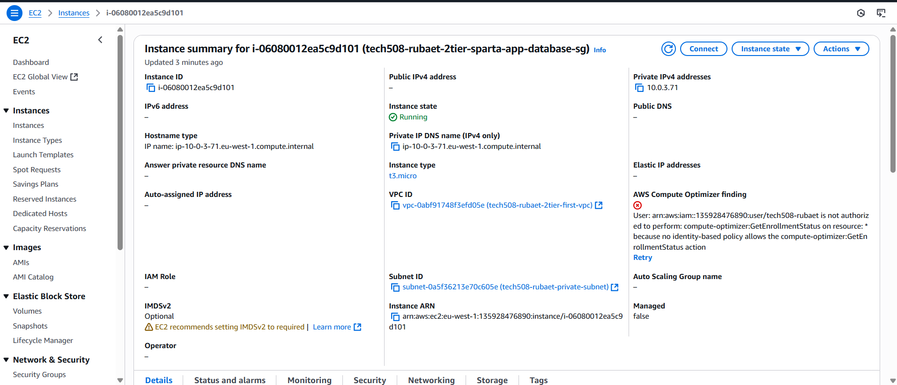

<!-- TOC -->
* [AWS Deployment Steps for tech508-rubaet](#aws-deployment-steps-for-tech508-rubaet)
  * [Part 1 — Create Custom VPC](#part-1--create-custom-vpc)
  * [Create Subnets](#create-subnets)
  * [Create Internet Gateway](#create-internet-gateway)
  * [Create Route Table](#create-route-table)
  * [Part 2 — Launch Database Instance (Private Subnet)](#part-2--launch-database-instance-private-subnet)
  * [Part 3 — Launch App Instance (Public Subnet)](#part-3--launch-app-instance-public-subnet)
  * [Part 4 — Auto Scaling & Load Balancer Setup](#part-4--auto-scaling--load-balancer-setup)
  * [Part 5 — Create Auto Scaling Group](#part-5--create-auto-scaling-group)
  * [Part 6 — Verify Setup](#part-6--verify-setup)
<!-- TOC -->

# AWS Deployment Steps for tech508-rubaet

## Part 1 — Create Custom VPC

- **Login to AWS**
- Go to **VPC** on the left-hand side
- Create VPC and select **VPC only**
- Name and Tag: `tech508-rubaet-2tier-first-vpc`
- IPv4 CIDR: `10.0.0.0/16`
- Click create VPC
- vpc is done now we are doing subnets

## Create Subnets
- Click **Subnets** on the left-hand side
- Create subnet:
  - VPC ID: enter your VPC name
  - Subnet name: `tech508-rubaet-public-subnet`
  - Availability Zone: Europe (Ireland) / euw1-az3 (eu-west-1a)
  - - IPv4 VPC CIDR block: `10.0.0.0/16`
  - IPv4 subnet CIDR block: `10.0.2.0/24`
- **Add new subnet**:
  - Subnet name: `tech508-rubaet-private-subnet`
  - Availability Zone: Europe (Ireland) / euw1-az3 (eu-west-1a)
  - IPv4 VPC CIDR block: `10.0.0.0/16`
  - IPv4 subnet CIDR block: `10.0.3.0/24`
- Click Create subnet

## Create Internet Gateway
- Click **Internet Gateway** on the left-hand side
- Create Internet Gateway:
  - Name tag: `tech508-rubaet-2tier-first-vpc-ig`
- Create and attach to your VPC

## Create Route Table
- Click **Route Tables** on the left-hand side
- Create route table:
  - Name tag: `tech508-rubaet-2tier-first-vpc-public-rt`
  - Select your VPC
- Create route table
- Actions → **Edit subnet associations** → select public subnet → Save
- Edit routes:
  - Add route:
    - Destination: `0.0.0.0/0`
    - Target: Internet Gateway (select your IGW)
  - Save

---

## Part 2 — Launch Database Instance (Private Subnet)

- Find your AMI (Database)
- Launch instance:
  - Name: `tech508-rubaet-2tier-sparta-app-database-sg`
  - Enter your aws key
  - VPC: **Private**
  - Auto assign public ip: disabled. You should be able to disable it because the subnet set up means they can communicate via the private IP of the db instance.
  - Create new security group:
    - Name: `tech508-rubaet-2tier-sparta-app-database-sg-allow-27017`
    - Remove default rules
    - Add rule:
      - Type: Custom TCP
      - Port range: `27017`
      - Source: Anywhere
- Launch

**You will not the public ip**

---

## Part 3 — Launch App Instance (Public Subnet)

- Find your AMI (App)
- Launch instance:
  - Name: `tech508-rubaet-2tier-sparta-app-ready-to-run-app`
  - VPC: **Public**
  - Auto-assign public IP: enable
  - Security group:
    - Name: `tech508-rubaet-2tier-vpc-sparta-app-allow-HTTP-SSH`
  - User Data:
    ```bash
    #!/bin/bash
    cd repo/app
    export DB_HOST=mongodb://<MYPRIVATEIP_FROM_DATABASE>:27017/posts
    pm2 start app.js
    ```
- Launch

---

## Part 4 — Auto Scaling & Load Balancer Setup

- Login to AWS
- In **EC2** go to **Launch Instance** and create:
  - Name: `tech508-rubaet-for-asg-app-lt`
  - AMI: `Owned by me` → `tech508-rubaet-test-sparta-app-ready-to-run`
  - Instance type: `t3.micro`
  - Key pair: select existing
  - Security group: `tech508-rubaet-sparta-app-allow-SSH-HTTP-3000`
  - - **Inbound Rules**:
     - SSH (22) from `0.0.0.0/0`
     - HTTP (80) from `0.0.0.0/0`
     - Custom TCP (3000, Description: SPARTA APP) from `0.0.0.0/0`
  - Advanced settings (User Data):
    ```bash
    #!/bin/bash
    cd repo/app
    pm2 start app.js
    ```
- Save as **Launch Template**
- Actions → **Launch instance with template**
- Launch
- Copy public IP and test in browser

---

## Part 5 — Create Auto Scaling Group

- Go to **Auto Scaling Groups**
- Create new group:
  - Name: `tech508-rubaet-app-asg`
  - Launch template: `tech508-rubaet-app-asg-lt`
- Network: choose subnets with DevOPpsStudentDefault in `1a`, `1b`, `1c`
- Attach to **new load balancer**:
  - Name: `tech508-rubaet-app-asg-lb`
  - Scheme: Internet-facing
  - Default routing target group:
    - Name: `tech508-rubaet-app-asg-lb-tg`
  - Enable ELB health checks
  - Health check grace period: `180` seconds
- Group size:
  - Desired: `2`
  - Min: `2`
  - Max: `3`
  - Scaling policy: Target tracking
  - Instance warmup: `180` seconds
- Add tag:  
  - Key: `Name`  
  - Value: `tech508-rubaet-app-asg-HA-SC`
- Create

---

## Part 6 — Verify Setup

- Open **Load Balancer** page
- Find DNS name for `tech508-rubaet-app-asg-lb`
- Paste into browser and test

http://tech508-rubaet-1287589021.eu-west-1.elb.amazonaws.com/
