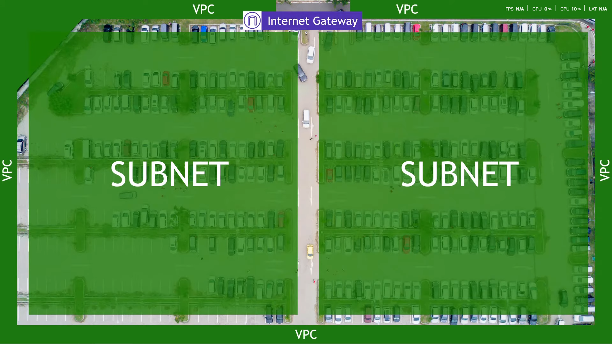

<!-- TOC -->
  * [Introduction to VPC.](#introduction-to-vpc)
  * [Understanding the concept of vpc:](#understanding-the-concept-of-vpc-)
    * [A car park analogy can be easily used to explain about vpc as follows:](#a-car-park-analogy-can-be-easily-used-to-explain-about-vpc-as-follows)
      * [Now lets understand in AWS terms](#now-lets-understand-in-aws-terms-)
      * [Going down one more level inside your VPC, you have **subnets**.](#going-down-one-more-level-inside-your-vpc-you-have-subnets-)
    * [Internet Gateway and NAT Gateway Explained](#internet-gateway-and-nat-gateway-explained)
    * [Network Flow Diagram](#network-flow-diagram)
* [AWS Deployment Steps for `tech508-rubaet`](#aws-deployment-steps-for-tech508-rubaet)
  * [Part 1 — Create Custom VPC](#part-1--create-custom-vpc)
    * [1) Log in to AWS](#1-log-in-to-aws)
    * [2) Open the VPC Service](#2-open-the-vpc-service)
    * [3) Create VPC (VPC Only)](#3-create-vpc-vpc-only)
    * [Create Subnets](#create-subnets)
      * [Public Subnet](#public-subnet)
      * [Private Subnet](#private-subnet)
    * [Create Internet Gateway (IGW)](#create-internet-gateway-igw)
    * [Create Route Table (Public)](#create-route-table-public)
  * [Part 2 — Launch Database Instance (Private Subnet)](#part-2--launch-database-instance-private-subnet)
  * [Part 3 — Launch App Instance (Public Subnet)](#part-3--launch-app-instance-public-subnet)
  * [Part 4 — Auto Scaling & Load Balancer Setup](#part-4--auto-scaling--load-balancer-setup)
* [Part 5 — Create Auto Scaling Group](#part-5--create-auto-scaling-group)
  * [Steps Explained](#steps-explained)
* [Part 6 — Verify Setup](#part-6--verify-setup)
  * [Why This Part Is Relevant](#why-this-part-is-relevant)
<!-- TOC -->

## Introduction to VPC.

- A VPC in AWS is a private, isolated network in the cloud where you can securely run and control your resources.

## Understanding the concept of vpc: 
### A car park analogy can be easily used to explain about vpc as follows:

 - Now lets look at the parking lot here and outside of the parking lot there is a whole world , <span style="color:yellow">aws</span> world lets say.


- So the fence , the border around the parking lot can be though of your vpc where it separates your vpc from the rest of the resources in aws

- Up in the top you can see traffic coming in from the outside world **"Internet Gateway"** and traffic flowing out to the outside world . In aws networking terms this would be the internet gateway that is  how your vpc talks to the internet.

- An Internet Gateway in AWS is a component that allows resources in your VPC (like EC2 instances) to connect to the internet and receive traffic from the internet.


- For our example we can say the left and the right of the parking lot. These are called the subnets in your aws networking terms. Generally be used in different purposes. 


- Now lets say one subnet has a route where it goes to the outside world to the internet if that's the case then this is the public subnet. the other side, the subnet that doesn't have the route to the internet that's a private subnet. It does not have any route to the outside word of the internet.
- Maybe in the public server you put the server that would host public facing webpages and in the private subnet you would put your database for example in sparta app , you would put your sparta app front page in public subnet and the database in the private. 
- This allows the database to be protected as there would be an extra layer of security to protect it from the outside world.

#### Now lets understand in AWS terms 


- First we have a region , this represent the geographic location in the world for example eu west 2 or 1


- Now within that you have the availability zone these are the data center within the region for example eu region 2a,2b,2c etc


- Your vpc is tied to a single region and it spans 2 or more availability zone 


#### Going down one more level inside your VPC, you have **subnets**.  
- Subnets are like **smaller sections or partitions of your VPC network**.  
- Each subnet is **tied to a specific Availability Zone (AZ)** within your region. For example:  
  - Subnet A in **eu-west-2a**  
  - Subnet B in **eu-west-2b**  

You usually create **two types of subnets**:  

1. **Public Subnet** – connected to the Internet Gateway, so resources here (like web servers) can send and receive traffic from the internet.  
2. **Private Subnet** – no direct route to the internet. Resources here (like databases) stay isolated for security.  

The key difference:  
- **Public Subnet = internet accessible**  
- **Private Subnet = no internet access**  

This setup allows you to keep sensitive resources (like databases) safe, while still making your applications accessible to users through the public subnet.


- Within your subnet that is where your actual resources live, your ec2 instances and so on


### Internet Gateway and NAT Gateway Explained

The **Internet Gateway (IGW)** works at the VPC level.  
A subnet becomes **public** when its route table has a default route (`0.0.0.0/0`) pointing to the IGW.  
This allows resources in that subnet (like web servers) to send and receive traffic from the internet.  

A **private subnet** doesn’t have a route to the IGW, so its resources cannot reach the internet directly.  
That’s good for security, but sometimes private instances still need internet access — for example, to download software updates or patches.  

To allow this, we use a **NAT Gateway (Network Address Translation Gateway):**

1. The NAT Gateway is created **inside a public subnet** (so it can talk to the IGW).  
2. The **private subnet’s route table** points internet-bound traffic to the NAT Gateway.  
3. The NAT Gateway then forwards that traffic to the IGW.  

With this setup:  

- Private instances can **connect out** to the internet (for updates, downloads, etc.).  
- The internet **cannot directly connect in** to the private instances.  

This gives you the best of both worlds:  
**Security (no inbound access) and functionality (outbound access).**

---

**Flow example:**  

### Network Flow Diagram

                 +-------------------+
                 |    Internet        |
                 +-------------------+
                           ^
                           |
                 +-------------------+
                 | Internet Gateway  |
                 +-------------------+
                           ^
                           |
                 +-------------------+
                 |   NAT Gateway     |  (in Public Subnet)
                 +-------------------+
                           ^
                           |
       +---------------------------------------+
       |            Private Subnet             |
       |  +-------------------+                |
       |  | Private Instance  |                |
       |  +-------------------+                |
       +---------------------------------------+


# AWS Deployment Steps for `tech508-rubaet`

## Part 1 — Create Custom VPC

### 1) Log in to AWS
You start by logging into the AWS Management Console because all infrastructure must be created and managed from your account and selected region.

### 2) Open the VPC Service
The VPC service is where you design your own isolated virtual network. This is necessary so your application resources can communicate securely without interference from other AWS users.

### 3) Create VPC (VPC Only)
- **Name and Tag:** `tech508-rubaet-2tier-first-vpc`  
  Giving the VPC a clear, descriptive name makes it easier to identify later and ensures that all resources can be grouped logically under the same project.
- **IPv4 CIDR:** `10.0.0.0/16`  
  This defines the private IP address range for your entire VPC. A `/16` block provides 65,536 possible addresses.
- **Create VPC**  
  AWS provisions your new isolated network along with a default route table, a default network ACL, and a default security group.

---

### Create Subnets
After defining the overall network boundary, you now break it down into subnets. Subnets allow you to separate resources into different zones, such as public-facing resources and private internal ones.

#### Public Subnet
1. **Click “Subnets”** on the left-hand side.  
   This is where you divide your VPC into smaller ranges of IP addresses, each tied to a specific Availability Zone (AZ).
2. **Create subnet:**
   - **VPC ID:** *(select your VPC)* — ensures the subnet is created inside the VPC you just built.
   - **Subnet name:** `tech508-rubaet-public-subnet` — descriptive name indicates it’s public.
   - **Availability Zone:** *Europe (Ireland) / `euw1-az3` (`eu-west-1a`)* — choose a specific AZ for predictable placement and fault isolation.
   - **IPv4 VPC CIDR block:** `10.0.0.0/16` — parent range.
   - **IPv4 subnet CIDR block:** `10.0.2.0/24` — allocates 256 IP addresses for the public subnet.

#### Private Subnet
3. **Add new subnet:**
   - **Subnet name:** `tech508-rubaet-private-subnet` — clearly labeled as private.
   - **Availability Zone:** *Europe (Ireland) / `euw1-az3` (`eu-west-1a`)* — keeping both subnets in the same AZ minimizes latency between app and database.
   - **IPv4 VPC CIDR block:** `10.0.0.0/16`
   - **IPv4 subnet CIDR block:** `10.0.3.0/24` — separate range isolates the database.
4. **Click “Create subnet”.**

---

### Create Internet Gateway (IGW)
1. **Click “Internet Gateways”** on the left-hand side.  
   The internet gateway allows resources in the VPC to connect to the internet and receive connections from the internet.
2. **Create Internet Gateway:**
   - **Name tag:** `tech508-rubaet-2tier-first-vpc-ig`
   - **Create and attach to your VPC** — makes it possible for subnets to route traffic to and from the internet.

---

### Create Route Table (Public)
1. **Click “Route Tables”** on the left-hand side.  
   A route table defines how network traffic is directed — whether to stay internal or go out to the internet.
2. **Create route table:**
   - **Name tag:** `tech508-rubaet-2tier-first-vpc-public-rt` — specifically for the public subnet.
   - **VPC:** *(select your VPC)*
   - **Create route table**
3. **Associate subnet:**  
   **Actions → Edit subnet associations → select public subnet → Save**  
   Links the public subnet to this route table so traffic follows public routes.
4. **Edit routes → Add route:**
   - **Destination:** `0.0.0.0/0` — “all traffic not matching local subnets.”
   - **Target:** Internet Gateway *(select your IGW)*
   - **Save** — enables full internet access for the public subnet.

---

## Part 2 — Launch Database Instance (Private Subnet)

1. **Find your AMI (Database)**  
   Use a preconfigured AMI that contains your database software (e.g., MongoDB).

2. **Launch instance:**  
   Provisions the actual database server in the private subnet.
   - **Name:** `tech508-rubaet-2tier-sparta-app-database-sg`
   - **Key pair:** *(enter your AWS key)* — for secure SSH access if needed.
   - **Subnet/VPC:** **Private** — ensures no direct internet access.
   - **Auto-assign public IP:** **Disabled** — reachable only via private IP.

3. **Create new security group:**
   - **Name:** `tech508-rubaet-2tier-sparta-app-database-sg-allow-27017`
   - **Remove default rules** — principle of least privilege.
   - **Add rule:**
     - **Type:** Custom TCP  
     - **Port range:** `27017`  
     - **Source:** `Anywhere`  
       > For production, restrict this to only the app servers or specific CIDRs.

4. **Launch**  
   The database server is provisioned in the private subnet.

> *This screenshot shows the instance successfully created.*


**You will not see a public IP.**  
Because it is in a private subnet, the database does not have a public IP, ensuring it is not exposed to the internet.

---

## Part 3 — Launch App Instance (Public Subnet)

1. **Find your AMI (App)**  
   Use an AMI with your application preinstalled and configured.

2. **Launch instance:**  
   - **Name:** `tech508-rubaet-2tier-sparta-app-ready-to-run-app`
   - **Subnet/VPC:** **Public** — so users and the load balancer can reach it.
   - **Auto-assign public IP:** **Enabled**
   - **Security group:** `tech508-rubaet-2tier-vpc-sparta-app-allow-HTTP-SSH`

3. **User Data (on boot):**
   ```bash
   #!/bin/bash
   cd repo/app
   export DB_HOST=mongodb://<MYPRIVATEIP_FROM_DATABASE>:27017/posts
   pm2 start app.js
   ```
   The script navigates to the app directory, sets the DB connection string (using the database’s private IP), and starts the application with PM2.

4. **Launch**  
   The application server comes online ready to connect to the private database.

---

## Part 4 — Auto Scaling & Load Balancer Setup

1. **Log in to AWS** (if needed).

2. **In EC2 → Launch instance** and create the base instance to save as a **Launch Template**:
   - **Name:** `tech508-rubaet-for-asg-app-lt`
   - **AMI:** *Owned by me →* `tech508-rubaet-test-sparta-app-ready-to-run`
   - **Instance type:** `t3.micro`
   - **Key pair:** *(select existing)*
   - **Security group:** `tech508-rubaet-sparta-app-allow-SSH-HTTP-3000`

   **Inbound rules:**
   - **SSH (22):** `0.0.0.0/0`
   - **HTTP (80):** `0.0.0.0/0`
   - **Custom TCP (3000):** `0.0.0.0/0`

   **Advanced settings (User Data):**
   ```bash
   #!/bin/bash
   cd repo/app
   pm2 start app.js
   ```

3. **Save as Launch Template**  
   Blueprint for all auto-scaled instances.

4. **Actions → Launch instance with template**  
   Create a single test instance to confirm it works.

5. **Launch**, then **copy the public IP** and **test in a browser**.

---

# Part 5 — Create Auto Scaling Group

At this stage, the application and database are already running, but there’s still a risk of downtime and limits on scalability. If your single app instance fails, the whole system goes down. If demand increases, a single instance might not be able to handle the load.

That’s where the **Auto Scaling Group (ASG)** comes in. The ASG automatically manages the number of application instances. It ensures a minimum number of servers are always running, replaces unhealthy ones, and adds or removes servers based on demand.

## Steps Explained

- **Go to Auto Scaling Groups**  
  This is where you configure how AWS will handle automatic scaling of your application servers.

- **Create new group → Name:** `tech508-rubaet-app-asg`  
  Giving the group a clear name ties it to the app tier of your architecture. This way, when you view your AWS resources, you know exactly what this ASG is responsible for.

- **Launch template:** `tech508-rubaet-app-asg-lt`  
  The ASG needs a blueprint to create new instances. The launch template you created earlier contains the AMI, instance type, security groups, and user data script. Using this ensures that every new instance the ASG creates is identical to your tested app server.

- **Network:** choose subnets with `DevOPpsStudentDefault` in **1a, 1b, 1c**  
  Here you place the ASG across multiple Availability Zones. This is important because if one AZ has issues, the app still runs in the others. It increases fault tolerance and ensures higher availability.

- **Attach to new load balancer → Name:** `tech508-rubaet-app-asg-lb`  
  The load balancer distributes traffic evenly across all running instances in the ASG. Instead of users connecting directly to one server, they connect to the load balancer’s DNS name. The LB then routes requests to whichever instances are healthy.

- **Scheme:** *Internet-facing*  
  This makes the load balancer accessible from the public internet. It acts as the main entry point to your application.

- **Default routing target group → Name:** `tech508-rubaet-app-asg-lb-tg`  
  The target group is where your app instances are registered. The load balancer checks this group to see which instances are healthy and ready to serve traffic.

- **Enable ELB health checks**  
  The ASG uses health checks from the load balancer to decide if an instance is healthy. If an instance stops responding, it’s automatically terminated and replaced.

- **Health check grace period:** `180` seconds  
  This allows new instances enough time to boot, start the app, and be ready before health checks mark them as unhealthy. Without this grace period, the ASG might mistakenly replace instances that are still starting up.

- **Group size:**
  - **Desired:** `2` → Always run two instances. This ensures that even if one fails, the app is still up.
  - **Min:** `2` → The ASG will never scale down below two, guaranteeing basic redundancy.
  - **Max:** `3` → The ASG can scale out to three instances when demand increases. This balances performance and cost.

- **Scaling policy:** *Target tracking*  
  This policy automatically adjusts the number of instances based on metrics like CPU utilization. For example, if CPU stays above 70%, the ASG adds more instances to handle the load.

- **Instance warmup:** `180` seconds  
  This prevents scaling decisions until new instances are fully initialized, avoiding rapid, unnecessary scaling up and down.

- **Add tag → Key:** `Name`, **Value:** `tech508-rubaet-app-asg-HA-SC`  
  Adding tags helps identify the purpose of the instances launched by the ASG. It makes resource management, cost tracking, and monitoring easier.

- **Create**  
  With this step, the Auto Scaling Group, Load Balancer, and Target Group are all provisioned. Now, your application is not just running — it is highly available and can handle changes in demand automatically.

---

# Part 6 — Verify Setup

After building the Auto Scaling Group and Load Balancer, you need to confirm everything works as expected.

- **Open Load Balancer page**  
  This is where you manage and view details about your load balancer, including health checks, DNS name, and registered instances.

- **Find DNS name for** `tech508-rubaet-app-asg-lb`  
  AWS assigns every load balancer a DNS name. This is the public endpoint that users will use to access your application.

- **Paste into browser and test**  
  By entering the DNS name in a web browser, you check if the load balancer is routing traffic to your running app instances. If the app page loads successfully, it means:
  - The load balancer is working.  
  - The ASG has launched the right number of instances.  
  - The instances are healthy and serving traffic.  
  - The private database connection (app → DB) is also working.

**Example DNS:**
```
http://tech508-rubaet-1287589021.eu-west-1.elb.amazonaws.com/
```
This link is proof that the application is deployed correctly and can be accessed from the internet.


---

## Why This Part Is Relevant

Part 5 and Part 6 are crucial because they transform your setup from a basic two-tier app into a production-ready, resilient system.

- Without the ASG, your app depends on one or two manually created servers. If one fails, users lose access.  
- Without the Load Balancer, traffic isn’t shared efficiently, and users have to rely on direct IPs that may change.  
- Verification ensures that the design works in real-world conditions.

Together, these steps guarantee **high availability**, **scalability**, and **reliability** — the core of cloud-native application deployment.

